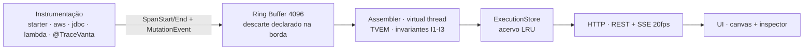

<div align="center">


# TraceVanta

**See your request travel through the system.**

*Uma dependência. Zero configuração. A árvore completa do que a sua aplicação fez — ao vivo, no navegador, sem deixar a sua máquina.*

[](LICENSE)
[](#compatibilidade-v01)
[](https://maven.apache.org)
[](CHANGELOG.md)
[](https://github.com/thiago701/tracevanta/actions/workflows/ci.yml)
[](CONTRIBUTING.md)

</div>

---

O **TraceVanta** transforma a sua aplicação Java numa *runtime canvas* interativa:
descubra endpoints, dispare requisições do próprio navegador e acompanhe a árvore
da execução em tempo real — código, **DynamoDB (delta before/after)**, SNS, SQS e
SQL — em `http://localhost:9876/tracevanta`.

Ergonomia do Swagger UI, ambição do tracing distribuído: **nada sai da sua máquina**,
tudo em memória, e a UI declara o que não conseguiu observar — nunca inventa.

---

## 📚 Índice

- [Por que TraceVanta](#-por-que-tracevanta)
- [Demonstração](#-demonstração)
- [Quickstart](#-quickstart)
- [Instrumentação](#-instrumentação)
- [Como funciona](#-como-funciona)
- [Arquitetura e módulos](#-arquitetura-e-módulos)
- [Configuração](#-configuração-tracevanta)
- [Segurança](#-segurança)
- [Compatibilidade](#-compatibilidade-v01)
- [Testes e qualidade](#-testes-e-qualidade)
- [Documentação](#-documentação)
- [Roadmap](#-roadmap)
- [Declarações de honestidade](#️-leia-antes-de-usar)
- [Contribuindo](#-contribuindo)
- [Licença](#-licença)

---

## ✨ Por que TraceVanta

| | |
|---|---|
| 🔍 **Árvore em tempo real** | Cada requisição vira uma árvore de nós (HTTP, negócio, banco, mensageria) com waterfall de tempos, self-time e erros — a UI reconstrói a árvore como o assembler faz |
| 📊 **Delta de dados EXACT** | `before/after` real do DynamoDB (ADR-003) e delta `inferred` de SQL — mutações correlacionadas por `spanId`, fora do pipeline OTel |
| 🔌 **Sem agente, sem config** | Uma dependência Maven. Nada de `-javaagent` — compatível com **GraalVM Native Image** (a razão de existir do produto) |
| 🧩 **Domínio-agnóstico** | O núcleo não conhece "pedido" nem "cliente": e-commerce, logística, fintech, saúde — qualquer área de negócio funciona sem customização |
| 🛡️ **Local-first** | Bind `127.0.0.1` por padrão, redaction **na origem**, token Bearer opcional no ingest, CSP restritivo — [SECURITY.md](SECURITY.md) |
| 📡 **Dois modos** | **Embedded** (a UI sobe no seu JVM) ou **Companion/Station** (Lambda, `sam local` e **multi-serviço em UMA árvore** via OTLP) |
| 🧪 **Testável** | Asserções sobre a árvore nos seus testes (`tracevanta-testing`), E2E com LocalStack real no CI |
| 📦 **Honestidade por design** | Spans perdidos, delta indisponível, cobertura sem agente — tudo **declarado na UI**, nunca presumido (invariantes I1–I3) |

---

## 🎬 Demonstração

| Visão geral + execuções | Árvore com waterfall | Delta EXACT | Execução com erro |
|---|---|---|---|
|  |  |  |  |

---

## 🚀 Quickstart

### Spring Boot (Embedded — padrão)

```xml
<!-- pom.xml -->
<dependency>
  <groupId>tech.neural7.tracevanta</groupId>
  <artifactId>tracevanta-spring-boot-starter</artifactId>
  <version>0.1.0-SNAPSHOT</version>
</dependency>
```

```java
@RestController
public class PedidoController {
    @PostMapping("/pedidos")
    public Pedido criar(@RequestBody NovoPedido request) {
        return service.criar(request); // @TraceVanta no serviço = nó BUSINESS na árvore
    }
}
```

Suba a app e abra **`http://localhost:9876/tracevanta`** — escolha `POST /pedidos`,
clique **EXECUTE REQUEST** e veja a requisição viajar.

### AWS Lambda (modo Companion com Station)

```bash
docker run -d --name tracevanta-station -p 9876:9876 \
  -e TRACEVANTA_BIND_ADDRESS=0.0.0.0 -e TRACEVANTA_ALLOW_NON_LOOPBACK=true \
  -e TRACEVANTA_STATION_TOKEN=seu-token tracevanta-station:0.1.0
```

```java
public class MinhaFuncao extends TraceVantaLambdaHandler<Map<String, String>, String> {
    @Override
    protected String handle(Map<String, String> input, Context ctx) { /* ... */ }
}
// envs da função: TRACEVANTA_STATION_ENDPOINT + TRACEVANTA_STATION_TOKEN
```

O runtime abre o span raiz (nó `LAMBDA`), correlaciona mutações e faz **flush
síncrono** no fim da invocação (ADR-002) — a árvore aparece no Station.

### Exemplos completos

| Exemplo | O que demonstra | Como rodar |
|---|---|---|
| [`examples/order-service`](examples/order-service/) | Spring Boot + DynamoDB + SNS/SQS fanout + consumidor (JC-1/2/3) + Native Image | `docker compose up --build` |
| [`examples/lambda-sqs`](examples/lambda-sqs/) | Lambda java21 + DynamoDB + SQS no LocalStack, consumidor na MESMA árvore, token Bearer | `./mvnw -f examples/lambda-sqs/pom.xml -DskipTests package && docker compose -f examples/lambda-sqs/docker-compose.yml up` |

---

## 🔌 Instrumentação

```java
// AWS SDK v2 — delta EXACT do DynamoDB + semântica SNS/SQS
DynamoDbClient ddb = TraceVantaAws.instrument(DynamoDbClient.builder(), traceVantaConfig).build();

// SQL — semântica + delta inferred (opcional)
DataSource ds = TraceVantaJdbc.wrap(myDataSource, traceVantaConfig);

// Negócio — um nó BUSINESS por método
@TraceVanta("CriarPedido")
public Pedido criar(NovoPedido r) { /* ... */ }

// Qualquer biblioteca sem library instrumentation — SPI via ServiceLoader (AOT-safe)
public interface TraceVantaExtension {
    default void contribute(NodeBuilder node, SpanView span) {}
    default Optional<DataMutation> captureMutation(MutationContext ctx) { return Optional.empty(); }
    default RedactionPolicy redactionPolicy() { return RedactionPolicy.INHERIT; }
    default List<EndpointDescriptor> discoverEndpoints() { return List.of(); }
    default int order() { return 0; }
}
```

---

## ⚙️ Como funciona



1. **Ponte** (`tracevanta-otel`): um `SpanProcessor` *acrescentado* ao pipeline
   OTel do dev — nunca o substitui. Se você já exporta para o Jaeger, continua exportando.
2. **Ring buffer** (ADR-006): fila limitada com `offer()`, nunca `put()` — sob
   rajada, eventos são descartados **e o descarte é exibido**.
3. **Assembler**: monta o TVEM com eventos fora de ordem; órfão é reparentado
   com aviso (I1); `selfTime` nunca negativo (I2); fidelidade do delta declarada (I3).
4. **Delta de dados** (ADR-003): canal lateral correlacionado por `spanId` —
   payload sensível nunca entra no pipeline OTel do dev.
5. **UI** (ADR-004/005): WebJar offline no próprio JAR, um `EventSource` por aba,
   tema escuro, teclado completo, waterfall — **nenhum byte sai da sua máquina**.

### Modos de execução (ADR-002)

| | **Embedded** (padrão) | **Companion / Station** |
| :--- | :--- | :--- |
| Onde roda a UI | No JVM da sua app, `:9876` | Container `tracevanta-station`, `:9876` |
| Para | Spring Boot local, `docker compose`, testes | Lambda, `sam local`, **multi-serviço em uma árvore** |
| Telemetria | SpanProcessor in-process | OTLP/HTTP `/v1/traces` + `/tvingest/v1/mutations` (Bearer opcional) |
| Flush em Lambda | — | **Síncrono no fim da invocação** (o ambiente congela), teto 200 ms |

---

## 🧩 Arquitetura e módulos

Visão completa (regras de dependência, fluxo, SPI): **[docs/ARQUITETURA.md](docs/ARQUITETURA.md)**.

| Módulo | Papel |
| :--- | :--- |
| `tracevanta-bom` | BOM: versões do projeto **e** de terceiros — declare sem versão |
| `tracevanta-core` | TVEM, ring buffer, assembler, redaction, config, SPI — POJO + JDK |
| `tracevanta-otel` | Ponte OTel: `SpanProcessor`, `SemanticMapper` (anti-corrupção, ADR-008) |
| `tracevanta-ui` | Assets da UI (WebJar, offline absoluto, zero referência externa) |
| `tracevanta-server` | REST + SSE sobre `com.sun.net.httpserver` (sem framework) |
| `tracevanta-spring-boot-starter` | Autoconfig Boot, catálogo, launcher, guarda de produção, hints AOT |
| `tracevanta-aws` | Delta DynamoDB (EXACT) + semântica SNS/SQS |
| `tracevanta-jdbc` | Semântica SQL + delta `inferred` |
| `tracevanta-lambda` | `TraceVantaLambdaHandler` com flush síncrono |
| `tracevanta-station` | Station standalone do modo Companion (ingest OTLP + mutações) |
| `tracevanta-testing` | JUnit 5 + asserções sobre a árvore (para os seus testes) |
| `tracevanta-architecture` | Regras ArchUnit que travam a arquitetura no CI |

---

## ⚙️ Configuração (`tracevanta.*`)

| Propriedade | Padrão | Nota |
| :--- | :--- | :--- |
| `enabled` | `true` em dev | kill switch: `-Dtracevanta.enabled=false` desliga tudo |
| `port` | `9876` | `0` = efêmera |
| `bind-address` | `127.0.0.1` | alterar exige `allow-non-loopback=true` |
| `buffer.capacity` | `4096` | eventos; descarte na borda é exibido na UI |
| `retention.max-executions` | `100` | LRU em memória |
| `payload.max-bytes` | `8192` | por nó |
| `redaction.mode` | `strict` | `strict` \| `keys` \| `off` |
| `aws.dynamodb.capture-before` | `true` (dev) | eleva `ReturnValues` e restaura a resposta (R-01) |
| `jdbc.mutation-capture` | `off` | `off` \| `inferred` |
| `station.endpoint` | — | modo Companion |
| `station.token` | — | Bearer do ingest (env `TRACEVANTA_STATION_TOKEN`) |
| `flush-timeout-ms` | `200` | Lambda |

---

## 🔒 Segurança

Política completa e modelo de ameaças: **[SECURITY.md](SECURITY.md)**.

- Bind **loopback por padrão**; exposição exige flag explícita + avisos.
- **Redaction na origem**: chaves sensíveis + padrões de valor (JWT, chaves AWS,
  cartão com Luhn, CPF/CNPJ, tokens GitHub, hashes bcrypt/argon2…) — mitigação declarada.
- **Token Bearer opcional** no ingest; hardening HTTP (CSP sem `unsafe-inline`,
  `nosniff`, `no-referrer`, `no-store`); limites de entrada; descarte declarado.
- Auditoria de CVEs das versões pinadas: nenhuma afetada (Jackson 2.22.2 e
  AssertJ 3.27.7 são exatamente as versões corrigidas — não rebaixar).
- Reporte: GitHub Security Advisory ou `security@neural7.tech`.

---

## 📦 Compatibilidade (v0.1)

| Eixo | Suportado |
| :--- | :--- |
| **JDK (construir/rodar)** | **21+** (CI em 21 e 25; bytecode baseline 21 — ADR-009) |
| Maven | **3.9+** (enforced; wrapper incluído) |
| Spring Boot | **4.0/4.1** |
| OpenTelemetry | SDK **1.66** / instrumentation **2.31** (semconv 1.44) |
| AWS SDK | **v2** (DynamoDB/SNS/SQS); Lambda `java21`/`java25` |
| GraalVM | **Native Image (JDK 25)** |
| LocalStack | **3/4** (validado em 4.2) |
| Navegador (UI) | Chrome/Edge/Firefox modernos (offline absoluto — ADR-005) |

Em **0.x a API pode quebrar entre minors** (SemVer a partir do 1.0.0 — ADR-010).

---

## 🧪 Testes e qualidade

```bash
./mvnw install                              # unidade + propriedade + contrato + ArchUnit
./mvnw -Pit -pl examples/order-service verify   # E2E LocalStack real (Docker)
./mvnw -Pit -pl examples/lambda-sqs verify      # E2E Lambda+SQS (Docker)
```

| Camada | O que cobre |
| :--- | :--- |
| Propriedade | Invariantes I1–I3 do TVEM sob eventos fora de ordem e perdidos (jqwik) |
| Contrato | `SemanticMapper` por fixture de span — bump do OTel quebra aqui, não na UI |
| Arquitetura | Regras de dependência + nenhum literal OTel fora da ponte + UI sem referência externa |
| Segurança | Corpus de redaction, SSRF do launcher, guarda de produção, token Bearer do ingest |
| E2E | LocalStack real (Testcontainers) + consistência UI↔API nas capturas de tela |

---

## 📖 Documentação

| Documento | Conteúdo |
| :--- | :--- |
| [SPEC.md](docs/SPEC.md) | Especificação técnica e arquitetural completa |
| [ARQUITETURA.md](docs/ARQUITETURA.md) | Módulos, fluxo de runtime, pontos de extensão |
| [docs/adr/](docs/adr/) | Decisões de arquitetura registradas (ADR-001…010) |
| [SECURITY.md](SECURITY.md) | Modelo de ameaças, limites declarados, reporte |
| [CHANGELOG.md](CHANGELOG.md) | Histórico completo desde o primeiro commit |
| [CONTRIBUTING.md](CONTRIBUTING.md) | Como contribuir (convenções e definição de pronto) |
| [docs/qa/](docs/qa/) | Evidências de QA: E2E, UX, consistência, telas |

---

## 🗺️ Roadmap

M0–M6 implementados na v0.1; **M5 (prova AOT)** no CI; **M7** entrega o Station.
Visões DAG/Waterfall/Sequence e exportação OTLP entram na v0.2 — detalhes em
[SPEC §11.1](docs/SPEC.md).

---

## ⚠️ LEIA ANTES DE USAR — declarações de honestidade

1. **Ferramenta de DEV-TIME — não empacote em produção.** O starter se
   autodesabilita fora de dev e **falha o boot** se forçado sem
   `tracevanta.i-know-what-im-doing=true` (SPEC §8.4).
2. **Quem tem a máquina, tem a UI.** Bind `127.0.0.1`, sem autenticação — em
   loopback, auth seria teatro (ADR-007). Expor além do loopback exige flag
   explícita e emite WARN; para uso remoto, túnel SSH.
3. **A captura do delta do DynamoDB modifica a sua requisição** (eleva
   `ReturnValues` e restaura a resposta — há teste provando a restauração;
   R-01). Desligue com `tracevanta.aws.dynamodb.capture-before=false`.
4. **Redaction é mitigação, não garantia.** Campo de negócio com nome inocente
   passa — o limite está declarado, não escondido (SPEC §8.3).
5. **Cobertura sem agente é limitada** — a UI diz "não instrumentado", nunca
   finge completude (R-02).

**Desvios registrados da SPEC** (honestidade acima de tudo — detalhes nos ADRs):

| Item | SPEC | v0.1 |
| :--- | :--- | :--- |
| `UpdateItem` before/after | §4.10: ambos em uma chamada | `after` EXACT via `ALL_NEW`, `before=null` **declarado na UI** |
| `tracevanta.port=0` | §5.4: "mesma porta da app" | porta efêmera (mesmo-que-a-app na v0.2) |
| SSE `execution.completed` | §5.2: campos flat | `{"executionId","execution":{…}}`; `duration` em ms |
| Schema por springdoc | §4.8 estratégia 1 | records via `RecordComponent` (springdoc na v0.2) |
| Catálogo Lambda | §4.8: parse de `template.yaml` | catálogo vazio (somente-observação), registrado como gap |
| `jdbc.mutation-capture=before-image` | §4.10: opt-in com aviso | **rejeitado com erro explícito** (nunca rebaixado em silêncio) |
| `ScopedValue` | §4.11: interno para executionId | não usado no núcleo (baseline 21) |

---

## 👥 Contribuindo

Pull requests são bem-vindas! Leia **[CONTRIBUTING.md](CONTRIBUTING.md)** e o
**[Código de Conduta](CODE_OF_CONDUCT.md)**. Decisão superada não é apagada —
ADRs ganham status `Substituída por`; CHANGELOG desde o primeiro commit;
build reprodutível e assinatura GPG no release.

---

<div align="center">

**TraceVanta** — *See your request travel through the system.*

Apache-2.0 © 2026 Neural7 Tech ·
[Especificação](docs/SPEC.md) · [ADRs](docs/adr/) · [Arquitetura](docs/ARQUITETURA.md) · [Segurança](SECURITY.md)

</div>
