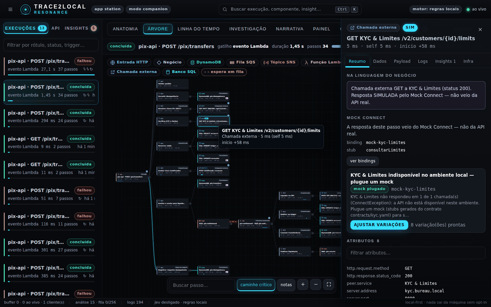
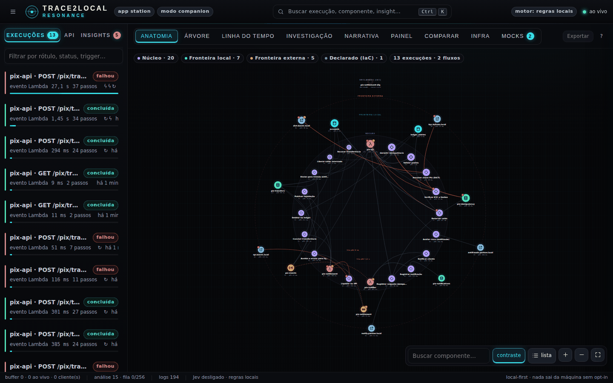
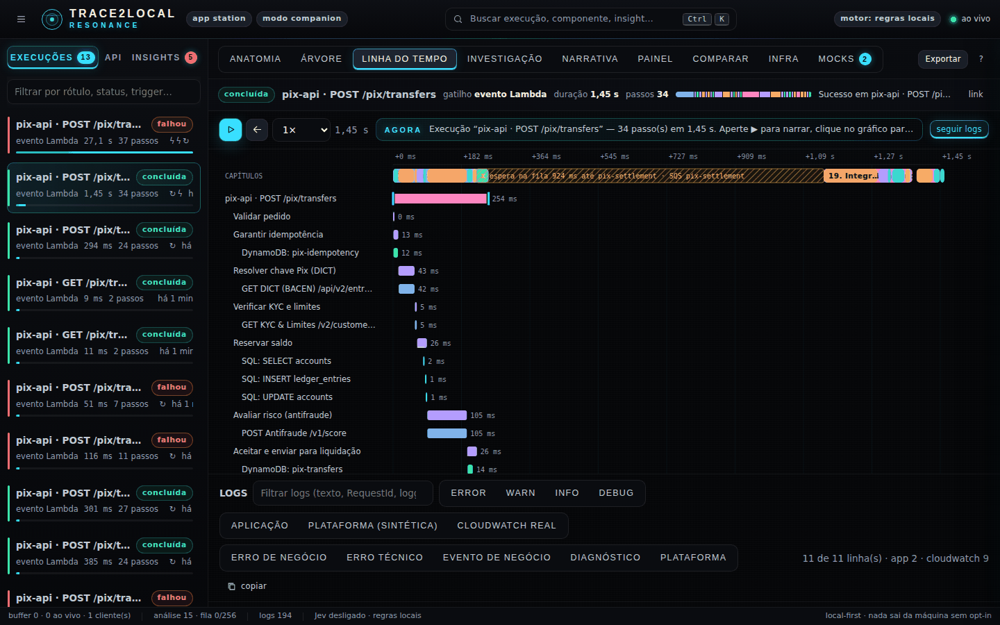
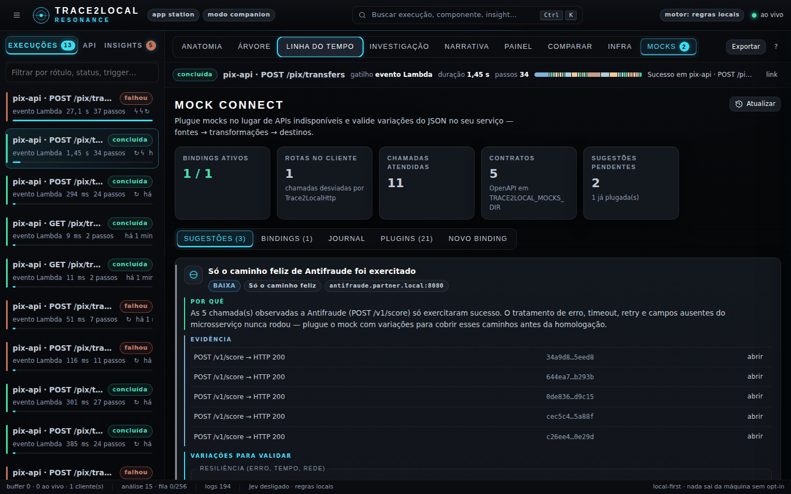
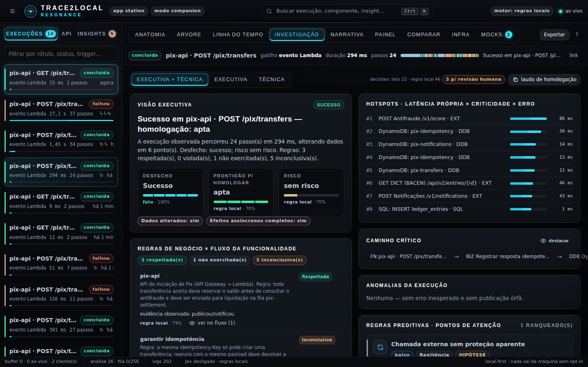
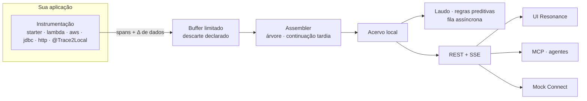

<div align="center">


# Trace2Local

**Veja a sua requisição atravessar o sistema — localmente, antes de chegar à nuvem.**

Observabilidade de *dev-time* para Java e AWS: cada requisição ou evento vira uma árvore de execução ao vivo —
código, DynamoDB/SQL com o dado antes → depois, SQS/SNS com o consumidor na mesma árvore, logs CloudWatch,
laudo de homologação, regras preditivas e mocks de parceiros. Nada sai da sua máquina.

[](https://github.com/thiago701/trace2local/actions/workflows/ci.yml)
[](LICENSE)
[](#compatibilidade)
[](#compatibilidade)
[](CHANGELOG.md)
[](CONTRIBUTING.md)

[Começar](#começar) · [Demo de 10 minutos](#demo-de-10-minutos-stack-financeira-completa) · [Documentação](#documentação) · [FAQ](#perguntas-frequentes) · [Segurança](SECURITY.md) · [Contribuir](CONTRIBUTING.md)



</div>

---

> [!NOTE]
> **Status: preview (`0.1.0-SNAPSHOT`).** Funcional e validado na stack alvo, ainda sem release no Maven Central;
> em `0.x` a API pode mudar entre minors ([política](docs/adr/ADR-010-distribuicao-licenca-e-compatibilidade.md)).
> Ferramenta de **desenvolvimento** — não é APM de produção.

## Por que o Trace2Local

Em sistemas serverless e orientados a eventos, a pergunta "o que aconteceu com esta requisição?" atravessa uma
Lambda, duas filas, três tabelas e quatro parceiros. Logs soltos não respondem; APM de produção chega tarde e não
roda no seu notebook. O Trace2Local responde **onde você desenvolve**:

| | |
|---|---|
| **Árvore ao vivo** | Cada execução vira uma árvore (HTTP, negócio, DynamoDB, SQL, SQS, SNS, Lambda, parceiros) com tempos, self time, erros e caminho crítico. Consumidores assíncronos entram **na mesma árvore**, com a espera na fila. |
| **Dado antes → depois** | Δ exato do DynamoDB e Δ inferido de SQL, correlacionados ao passo — fora do pipeline OTel, redigidos na origem. |
| **Logs onde importam** | Logs da app e do CloudWatch (LocalStack) presos ao passo e à invocação, numa linha do tempo narrada. |
| **Homologação** | Laudo executivo e técnico: desfecho, risco, **regras de negócio × fluxo** com veredito, checklist — cada decisão com o motor e a confiança. |
| **Regras preditivas** | N+1, idempotência, fila lenta, regressão, resiliência, dado sensível, deriva de IaC — sempre com evidência navegável; fato ≠ hipótese. |
| **Mock Connect** | Pluga mocks de parceiros indisponíveis e valida variações da resposta JSON — sugeridos pelos próprios traces, no modelo do Kafka Connect. |
| **Agentes de IA** | Servidor **MCP**: assistentes de código leem a execução real (`diagnose_failure`, `compare_executions`…) — somente leitura por padrão. |
| **Sem agente JVM** | Uma dependência. Sem `-javaagent`; compatível com **GraalVM Native Image** e Lambda Java 25. |
| **Local-first** | Bind loopback, redaction na origem, CSP estrita, anti-CSRF; inteligência determinística local por padrão. |

## Começar

| para | você precisa de |
|---|---|
| usar a biblioteca numa app Spring Boot ou Lambda | **JDK 21+** e Maven (o wrapper `./mvnw` já vem no repositório) ou Gradle |
| rodar a demo completa (`examples/finance-pix`) | **Docker** — no Windows, só o Docker Desktop; no Linux/macOS, também JDK 25, Maven e Terraform ≥ 1.6 |
| ligar agentes de IA (MCP) | JRE 21+ e um harness compatível (Claude Code, Cursor, VS Code…) |

### 1. Instale a biblioteca

Enquanto não há release no Maven Central, publique os artefatos no seu repositório Maven local (uma vez por versão):

```bash
git clone https://github.com/thiago701/trace2local.git && cd trace2local
./mvnw -B install -DskipTests              # Windows: .\mvnw.cmd -B install -DskipTests
```

### 2. Spring Boot — modo embedded

A UI e a API sobem **dentro** da sua aplicação, em `http://localhost:9876/trace2local`.

**a) Adicione a dependência**

<table>
<tr><th>Maven</th><th>Gradle (Kotlin DSL)</th></tr>
<tr><td>

```xml
<dependencyManagement>
  <dependencies>
    <dependency>
      <groupId>tech.neural7.trace2local</groupId>
      <artifactId>trace2local-bom</artifactId>
      <version>0.1.0-SNAPSHOT</version>
      <type>pom</type>
      <scope>import</scope>
    </dependency>
  </dependencies>
</dependencyManagement>

<dependencies>
  <dependency>
    <groupId>tech.neural7.trace2local</groupId>
    <artifactId>trace2local-spring-boot-starter</artifactId>
  </dependency>
</dependencies>
```

</td><td>

```kotlin
repositories {
    mavenLocal()      // até o release no Maven Central
    mavenCentral()
}

dependencies {
    implementation(platform(
        "tech.neural7.trace2local:trace2local-bom:0.1.0-SNAPSHOT"))
    implementation(
        "tech.neural7.trace2local:trace2local-spring-boot-starter")
}
```

</td></tr>
</table>

Ou deixe o plugin fazer por você, sem sobrescrever nada:

```bash
./mvnw tech.neural7.trace2local:trace2local-maven-plugin:0.1.0-SNAPSHOT:analyze     # só lê: relatório do que será observado
./mvnw tech.neural7.trace2local:trace2local-maven-plugin:0.1.0-SNAPSHOT:configure   # BOM + starter + glossário + config + logback
```

**b) Inicie com o perfil `trace2local`**

O starter só liga em perfil de desenvolvimento — `trace2local`, `dev`, `development`, `local` ou `localstack`. Em
qualquer outro ele se desliga sozinho, então a mesma dependência pode seguir no artefato sem efeito em produção.

```bash
./mvnw spring-boot:run -Dspring-boot.run.profiles=trace2local
```

Windows: `.\mvnw.cmd spring-boot:run "-Dspring-boot.run.profiles=trace2local"` · IDE: *Active profiles* =
`trace2local` · contêiner: `SPRING_PROFILES_ACTIVE=trace2local`. O boot confirma:

```text
INFO  Trace2Local em http://127.0.0.1:9876/trace2local — modo Embedded | redaction=STRICT | capture-before=true
```

Sem essa linha, o perfil não está ativo.

**c) Use** — abra **http://localhost:9876/trace2local**, escolha um endpoint na aba **API**, clique em
**▶ Executar** e acompanhe a árvore crescer. Requisições feitas por qualquer cliente (curl, Postman, front-end)
também aparecem.

**d) Enriqueça a árvore** (opcional)

| para ver | faça | módulo |
|---|---|---|
| passos de negócio com nome do domínio | `@Trace2Local("Criar pedido")` no método (Spring AOP, sem agente) | starter |
| DynamoDB com o dado antes → depois | `Trace2LocalAws.instrument(DynamoDbClient.builder(), cfg)` | `trace2local-aws` |
| SQS/SNS com o consumidor na mesma árvore | `Trace2LocalAws.instrument(SqsClient.builder())` e `Trace2LocalMessaging.sqsAttributes()` ao publicar | `trace2local-aws` |
| SQL com Δ inferido | `Trace2LocalJdbc.wrap(dataSource, cfg)` + `trace2local.jdbc.mutation-capture=inferred` | `trace2local-jdbc` |
| parceiros HTTP com nome | `Trace2LocalHttp.instrument(httpClient, "Antifraude")` | starter |
| regras de negócio julgadas na Investigação | `src/main/resources/trace2local-business.md` | starter |

O bean `Trace2LocalConfig` só existe com a ferramenta ligada — injete-o por `ObjectProvider` para o mesmo código
subir em produção:

```java
@Bean
DynamoDbClient dynamoDb(ObjectProvider<Trace2LocalConfig> trace2local) {
    DynamoDbClientBuilder builder = DynamoDbClient.builder();
    trace2local.ifAvailable(cfg -> Trace2LocalAws.instrument(builder, cfg));   // inerte fora de dev
    return builder.build();
}
```

**e) Configure** (opcional — os padrões servem ao caso comum) em `application-trace2local.yml`:

```yaml
trace2local:
  port: 9876                    # UI e API (0 = porta livre)
  redaction:
    mode: strict                # strict | keys | off — mascara dados sensíveis na origem
  retention:
    max-executions: 100
  aws:
    dynamodb:
      capture-before: true      # Δ exato do DynamoDB (eleva ReturnValues — ver Limites declarados)
  jdbc:
    mutation-capture: inferred  # off | inferred
```

`trace2local.enabled=false` desliga tudo sem remover a dependência. Referência completa: [SPEC §5.4](docs/SPEC.md).

### 3. AWS Lambda — modo Companion (Station)

Em Lambda não há processo longo para hospedar a UI: as funções enviam a telemetria para o **Station**, que monta a
árvore de todas elas (e dos consumidores SQS/SNS) num lugar só.

**a) Suba o Station** — como contêiner na mesma rede do LocalStack (modelo pronto em
[`examples/finance-pix/docker-compose.yml`](examples/finance-pix/docker-compose.yml)) ou direto no host:

```bash
java -jar trace2local-station/target/trace2local-station-0.1.0-SNAPSHOT.jar   # UI em http://localhost:9876/trace2local
```

**b) Adicione `trace2local-lambda`** (mais `trace2local-aws`/`trace2local-jdbc` se usar DynamoDB, SQS/SNS ou SQL) e
estenda o handler base:

```java
public final class PedidoHandler extends Trace2LocalLambdaHandler<Map<String, Object>, Map<String, Object>> {
    @Override protected SpanContext remoteParentOf(Map<String, Object> e, Context c) { return Trace2LocalTraceContext.fromApiGatewayEvent(e); }
    @Override protected Map<String, Object> handle(Map<String, Object> e, Context c) throws Exception {
        return step("Criar pedido", () -> service.criar(e));      // passo de negócio na árvore
    }
}
```

**c) Aponte a função para o Station**

| variável | exemplo | efeito |
|---|---|---|
| `TRACE2LOCAL_STATION_ENDPOINT` | `http://trace2local-station:19877` | destino da telemetria (rede do compose) |
| `TRACE2LOCAL_STATION_TOKEN` | o mesmo do Station | Bearer do ingest |
| `TRACE2LOCAL_JDBC_MUTATION_CAPTURE` | `inferred` | Δ inferido de SQL (opcional) |

Sem endpoint o runtime é *pass-through*: o mesmo artefato vai para a AWS sem custo. Guia completo com SQS/SNS, JDBC,
parceiros HTTP, Terraform e GraalVM nativo: [examples/finance-pix](examples/finance-pix/README.md).

### 4. Agentes de IA (MCP)

```bash
./mvnw -pl trace2local-mcp -am package -DskipTests   # → trace2local-mcp/target/trace2local-mcp-0.1.0-SNAPSHOT-all.jar
```

```json
{ "mcpServers": { "trace2local": { "command": "java",
  "args": ["-jar", "trace2local-mcp/target/trace2local-mcp-0.1.0-SNAPSHOT-all.jar"],
  "env": { "TRACE2LOCAL_URL": "http://127.0.0.1:9876/trace2local", "TRACE2LOCAL_MCP_TOOLS": "core" } } } }
```

Claude Code, Cursor, VS Code e outros harnesses passam a ler execuções, causas raiz, laudos e sugestões de mock.
Somente leitura e dados estruturais por padrão — [docs/MCP.md](docs/MCP.md).

### Não apareceu nada?

| sintoma | causa provável | correção |
|---|---|---|
| sem a linha `Trace2Local em http://…` no boot | perfil de desenvolvimento inativo | `-Dspring-boot.run.profiles=trace2local` |
| boot falha com "NÃO DEVE subir em produção" | `trace2local.enabled=true` forçado fora de dev | remova a propriedade ou use um perfil de dev |
| UI responde 421 | `Host` fora da allowlist | acesse por `localhost`/`127.0.0.1` |
| porta 9876 ocupada | outra instância ou app | `trace2local.port` (Station: `TRACE2LOCAL_PORT`) |
| Lambda não aparece no Station | endpoint/token/rede | procure `WARN Trace2Local: o envio ao Station não confirmou` no log da função |

## Demo de 10 minutos: stack financeira completa

[`examples/finance-pix`](examples/finance-pix/README.md) é um serviço de **transferências Pix** 100 % local:
API Gateway (OpenAPI) → Lambda **Java 25** (JVM ou nativo GraalVM) → DynamoDB · Postgres (RDS) · SQS → Lambda ·
SNS → Lambda · 5 APIs de parceiros, tudo provisionado por **Terraform** no **LocalStack**.

**Windows** — só com o Docker Desktop (build, LocalStack e Terraform rodam em containers):

```powershell
examples\finance-pix\scripts\up.cmd          # ou: powershell -ExecutionPolicy Bypass -File examples\finance-pix\scripts\up.ps1
```

**Linux / macOS**:

```bash
cd examples/finance-pix && ./scripts/up.sh && python3 scripts/journeys.py   # sobe e roda as 12 jornadas de aceite
```

| endereço | o quê |
|---|---|
| http://localhost:19877/trace2local | UI do Trace2Local (Resonance) — abre sozinha no fim do `up` |
| http://localhost:4568/restapis/pixapi/local/_user_request_/pix/transfers | API Pix (API Gateway do LocalStack) |
| http://localhost:19878 | Mock Connect (gestão em `/trace2local/api/mocks`) |

Para derrubar tudo: `up.cmd -Down` (Windows) ou `docker compose down -v` em `examples/finance-pix`. Atrás de proxy
corporativo com inspeção TLS: `up.cmd -CaBundle C:\caminho\ca-da-empresa.pem`.

| Anatomia | Linha do tempo + CloudWatch | Mock Connect | Investigação |
|---|---|---|---|
|  |  |  |  |

As 12 jornadas conferem a ferramenta **contra o estado real** (psql, DynamoDB) em seis níveis — **61/61 em JVM e
em nativo**; cold start nativo 808 ms × JVM 2 191 ms ([critério de aceite](docs/qa/ACEITE.md)).

## Como funciona


```mermaid
flowchart LR
    subgraph app[Sua aplicação]
      I[Instrumentação<br/>starter · lambda · aws · jdbc · http · @Trace2Local]
    end
    I -->|spans + Δ de dados| B[Buffer limitado<br/>descarte declarado]
    B --> A[Assembler<br/>árvore · continuação tardia]
    A --> S[Acervo local]
    S --> P[Laudo · regras preditivas<br/>fila assíncrona]
    S --> H[REST + SSE]
    H --> U[UI Resonance]
    H --> M[MCP · agentes]
    H --> C[Mock Connect]
```

| | Embedded (padrão) | Companion / Station |
|---|---|---|
| Onde roda | no JVM da aplicação, `:9876` | processo/contêiner `trace2local-station` |
| Para | Spring Boot local, `docker compose`, testes | Lambda, LocalStack, `sam local`, vários serviços numa árvore |
| Telemetria | `SpanProcessor` no processo | OTLP/HTTP + canal de mutação + logs (Bearer) |
| Lambda | — | flush síncrono no fim da invocação, com orçamento |

Arquitetura detalhada: [docs/ARQUITETURA.md](docs/ARQUITETURA.md) · especificação: [docs/SPEC.md](docs/SPEC.md) ·
decisões: [docs/adr](docs/adr/README.md).

## Módulos

| módulo | papel |
|---|---|
| `trace2local-bom` | versões do projeto e de terceiros |
| `trace2local-core` | modelo de execução, buffer, assembler, redaction, SPI — só JDK |
| `trace2local-otel` | ponte OpenTelemetry (único lugar com nomes de atributo OTel — ADR-008), HTTP client, passos de negócio |
| `trace2local-spring-boot-starter` | autoconfiguração, catálogo de endpoints, disparo, hints AOT |
| `trace2local-lambda` | handler base, contexto de trace de API Gateway/SQS/SNS, flush síncrono |
| `trace2local-aws` · `trace2local-jdbc` | DynamoDB (Δ exato), SQS/SNS (propagação), SQL (Δ inferido) |
| `trace2local-station` | modo Companion: ingest OTLP, tail CloudWatch do LocalStack, disparo pelo contrato OpenAPI |
| `trace2local-predictive` | laudo executivo/técnico, regras assíncronas preditivas, micro-decisões |
| `trace2local-mocks` | Mock Connect ([docs/MOCKS.md](docs/MOCKS.md)) |
| `trace2local-mcp` | servidor MCP para agentes ([docs/MCP.md](docs/MCP.md)) |
| `trace2local-server` · `trace2local-ui` | REST + SSE; UI Resonance (offline, CSP estrita) |
| `trace2local-testing` · `trace2local-maven-plugin` · `trace2local-architecture` | asserções sobre a árvore · instalador · guarda-rails no CI |

## Compatibilidade

| eixo | suportado |
|---|---|
| JDK | **21+** (bytecode baseline 21; CI em 21 e 25) |
| Spring Boot | 4.0 / 4.1 |
| AWS | SDK v2 (DynamoDB, SQS, SNS); Lambda `java21`, `java25` e `provided.al2023` (JVM jlink ou nativo) |
| GraalVM | Native Image (JDK 25) |
| OpenTelemetry | SDK 1.66 / instrumentation 2.31 |
| LocalStack | 3 / 4 (validado em 4.9) · Terraform AWS provider `~> 5.100` |
| Navegador | Chrome, Edge, Firefox atuais — a UI é 100 % offline |

Em **0.x a API pode mudar entre minors**; SemVer estrito a partir do 1.0 ([ADR-010](docs/adr/ADR-010-distribuicao-licenca-e-compatibilidade.md)).

## Qualidade

Uma versão só é aceita com todos os níveis verdes — [docs/qa/ACEITE.md](docs/qa/ACEITE.md):

| nível | o que prova | resultado atual |
|---|---|---|
| L0 | unidades, contratos, propriedades, guarda-rails de arquitetura, UI offline e CSP | `mvn install` verde |
| L1–L6 | jornadas reais na stack alvo: contrato, árvore, dados reais, assíncrono, mocks, ferramenta | 61/61 JVM · 61/61 nativo |
| L7 | usabilidade por persona (Playwright) + contraste WCAG medido em todo texto visível | 69/69 |
| L7b | agentes via MCP (cliente real) | 14/14 |
| — | regras preditivas: 35 cenários (15 controles) | precisão/recall 1,00 · 0 falso positivo |

```bash
AWS_REGION=us-east-1 ./mvnw -B install                 # L0
./mvnw -Pit -pl examples/order-service,examples/lambda-sqs verify   # E2E com Testcontainers + LocalStack
```

## Segurança

Ferramenta de desenvolvimento, segura por padrão: bind `127.0.0.1`, redaction na origem, CSP sem `unsafe-inline`,
allowlist de `Host` e anti-CSRF, token opcional para ambientes compartilhados, inteligência sem egress por padrão,
Mock Connect e MCP com opt-in para qualquer mutação. Modelo de ameaças e limites declarados em
[SECURITY.md](SECURITY.md) e [docs/SEGURANCA-CORPORATIVA.md](docs/SEGURANCA-CORPORATIVA.md).
Vulnerabilidades: GitHub Security Advisory ou `security@neural7.tech` — não abra issue pública.

## Documentação

| documento | conteúdo |
|---|---|
| [ARQUITETURA.md](docs/ARQUITETURA.md) · [SPEC.md](docs/SPEC.md) | módulos, fluxo de runtime, extensões · especificação completa |
| [docs/adr](docs/adr/README.md) | decisões de arquitetura (ADR-001 a ADR-017) |
| [UX-RESONANCE.md](docs/UX-RESONANCE.md) | identidade visual, visões, acessibilidade |
| [MOCKS.md](docs/MOCKS.md) | Mock Connect: conselheiro, binding, plugins, REST |
| [MCP.md](docs/MCP.md) | servidor MCP: instalação por harness, ferramentas, segurança |
| [PREDICTIVE.md](docs/PREDICTIVE.md) | regras assíncronas preditivas: catálogo, confiança, benchmarks |
| [SEGURANCA-CORPORATIVA.md](docs/SEGURANCA-CORPORATIVA.md) | revisão de segurança, topologias, governança de dados |
| [docs/qa](docs/qa/) | aceite, validações na stack alvo, benchmarks, evidências |
| [AGENTS.md](AGENTS.md) · [CONTRIBUTING.md](CONTRIBUTING.md) | guia para agentes e contribuidores |
| [CHANGELOG.md](CHANGELOG.md) | histórico desde o primeiro commit |

## Perguntas frequentes

<details>
<summary><b>Substitui um APM (Datadog, X-Ray, New Relic)?</b></summary>

Não. O Trace2Local responde "o que esta requisição fez?" **enquanto você desenvolve**, com o dado antes → depois e
o consumidor assíncrono na mesma árvore. Em produção o runtime Lambda é *pass-through* e o starter se desliga; os
logs com `trace_id` gerados aqui continuam correlacionáveis no seu APM.
</details>

<details>
<summary><b>Algum dado sai da minha máquina?</b></summary>

Não por padrão. A UI é servida em `127.0.0.1`, é 100 % offline e a inteligência é determinística e local. Integrações
que poderiam enviar algo para fora (por exemplo, um modelo externo de micro-decisão) exigem configuração e chave
explícitas — veja [SECURITY.md](SECURITY.md).
</details>

<details>
<summary><b>Preciso de Spring Boot? E de agente JVM?</b></summary>

Nenhum dos dois. Spring Boot ganha o modo embedded com zero configuração; Lambdas usam `trace2local-lambda` com o
Station; qualquer serviço que exporte **OTLP/HTTP** aparece na árvore do Station (sem o Δ de dados). Não há
`-javaagent`, por isso funciona em GraalVM Native Image.
</details>

<details>
<summary><b>Funciona no Windows?</b></summary>

Sim. A biblioteca é Java puro; a demo completa sobe com `up.cmd` usando só o Docker Desktop (o pacote da Lambda é
gerado num container Linux, como a AWS exige).
</details>

## Limites declarados

1. **Dev-time, não produção.** O starter se desabilita fora de dev e falha o boot se forçado sem
   `trace2local.i-know-what-im-doing=true`; o runtime Lambda sem Station é *pass-through*.
2. **A captura do Δ do DynamoDB altera a requisição** (eleva `ReturnValues` e restaura a resposta — testado).
   Desligue com `trace2local.aws.dynamodb.capture-before=false`.
3. **Redaction é mitigação, não garantia**: campo de negócio com nome inocente pode passar.
4. **Cobertura sem agente é declarada**: o que não foi instrumentado aparece como tal, nunca como completo.
5. **Simulado nunca se passa por real**: respostas do Mock Connect são marcadas (SIM/↪) em todas as visões.

## Roadmap

Visões DAG/sequência e exportação OTLP (v0.2) · rota do contrato nas chamadas a parceiros · acervo persistente
opcional no Station · roteamento de mock para clientes não-Java · SLO por parceiro na Anatomia — detalhes em
[docs/SPEC.md](docs/SPEC.md) §11 e [docs/qa/finance-pix/ANALISE-RESULTADOS.md](docs/qa/finance-pix/ANALISE-RESULTADOS.md).

## Suporte

| preciso de | onde |
|---|---|
| reportar um bug | [issue com o modelo de bug](.github/ISSUE_TEMPLATE/bug-report.md) — inclua versão, modo (embedded/Station) e o `executionId` |
| propor uma funcionalidade | [issue com o modelo de feature](.github/ISSUE_TEMPLATE/feature-request.md) |
| reportar uma vulnerabilidade | GitHub Security Advisory ou `security@neural7.tech` (nunca issue pública) — [SECURITY.md](SECURITY.md) |

## Contribuindo

Contribuições são bem-vindas. Leia o [CONTRIBUTING.md](CONTRIBUTING.md), o [Código de Conduta](CODE_OF_CONDUCT.md)
e o [AGENTS.md](AGENTS.md) (regras inegociáveis: local-first, UI offline sob CSP, ACL de atributos OTel, aceite
multinível). Decisão superada não é apagada: ganha um novo ADR.

## Agradecimentos

Construído sobre [OpenTelemetry](https://opentelemetry.io). Validado com [LocalStack](https://localstack.cloud) e
[Testcontainers](https://testcontainers.com). O Mock Connect se inspira no modelo de conectores do
[Kafka Connect](https://kafka.apache.org/documentation/#connect) e interopera com [WireMock](https://wiremock.org).

## Licença

[Apache License 2.0](LICENSE) · © 2026 Neural7 Tech · veja também [NOTICE](NOTICE).
