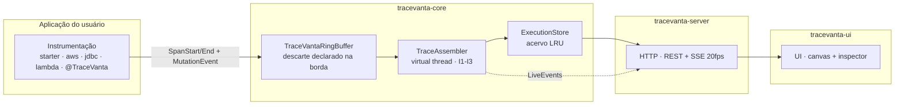

# Arquitetura do TraceVanta

> Visão de estrutura para quem vai **adotar**, **estender** ou **contribuir**.
> Decisões registradas: [ADRs](adr/) · Especificação formal: [SPEC.md](SPEC.md).

## Princípios

1. **Domínio-agnóstico** — o núcleo não conhece nenhum conceito de negócio
   (nada de "pedido", "cliente", "conta"). Os conceitos são genéricos: nó,
   execução, mutação de dados, trigger. Qualquer área (e-commerce, logística,
   fintech, saúde) funciona sem customização.
2. **Local-first** — ferramenta de desenvolvimento; loopback por padrão,
   redaction na origem (ADR-007).
3. **Zero agente** — instrumentação por código (interceptores, wrapper, AOP),
   sem javaagent em runtime (ADR-001/PESQUISA).
4. **Degradação honesta** — telemetria é best-effort: o que não pôde ser
   observado é **declarado** na UI (invariantes I1–I3), nunca presumido.
5. **Anti-corrupção semântica** — nomes de atributos do OTel existem em UM
   lugar (`OtelAttributeNames`); um bump do OTel quebra o teste de contrato,
   não a experiência do dev (ADR-008).

## Visão de módulos (reactor Maven)

| Módulo | Papel | Depende de |
|---|---|---|
| `tracevanta-bom` | BOM: versões do projeto + de terceiros (OTel, AWS, Jackson, testes) | — |
| `tracevanta-core` | TVEM (modelo de execução), ring buffer, assembler, redaction, config, SPI | — |
| `tracevanta-otel` | Ponte OTel↔TVEM: `SpanProcessor`, mapper semântico, boot do SDK | core |
| `tracevanta-ui` | Assets offline da UI (WebJar; zero referência externa) | — |
| `tracevanta-server` | HTTP (REST+SSE) sobre `com.sun.net.httpserver`, servidor estático, launcher | core, ui |
| `tracevanta-aws` | Instrumentação AWS SDK v2 (DynamoDB delta EXACT, SNS/SQS spans) | core, otel |
| `tracevanta-jdbc` | Delta de dados via JDBC (`mutation-capture=inferred`) | core |
| `tracevanta-lambda` | Modo Lambda: span raiz + flush síncrono + editor OTLP/mutações | core, otel |
| `tracevanta-station` | Modo Companion: ingest OTLP + canal de mutação (multi-serviço) | core, otel, server |
| `tracevanta-spring-boot-starter` | Autoconfig Boot: Embedded ou Companion, launcher, `@TraceVanta` | core, otel, server, aws |
| `tracevanta-testing` | JUnit extension + assertions para os consumidores | core |
| `tracevanta-architecture` | Regras ArchUnit que travam esta arquitetura no CI | — |
| `examples/*` | `order-service` (Spring) e `lambda-sqs` (serverless) — só demonstração | lib |

Regra de dependência (travada por ArchUnit): `core` não conhece ninguém;
módulos de ponte conhecem só `core` (+ o SDK de terceiros que instrumentam);
`server`/`station` orquestram; **nada depende de `examples`**.

## Fluxo de dados em runtime

1. A instrumentação emite eventos (`SpanStartEvent`, `SpanEndEvent`,
   `MutationEvent`) para o ring buffer (ADR-006) — nunca bloqueia o app.
2. O **assembler** (virtual thread) monta o TVEM: árvore por `parentId`,
   correlação de mutação por `spanId`, órfãos reparentados com aviso,
   `selfTime` = total − filhos sobrepostos.
3. O **hub SSE** propaga `LiveEvent`s coalescidos (20 fps) para a UI, que
   reconstrói a árvore por `parentId` (snapshots parciais não são confiáveis).
4. Modo **Embedded**: tudo no mesmo processo. Modo **Companion/Station**:
   OTLP `/v1/traces` + mutações `/tvingest/v1/mutations` alimentam o mesmo
   buffer — vários serviços viram UMA árvore (opcionalmente com Bearer token).

## Pontos de extensão (SPI)

| SPI | Propósito | Exemplo de uso |
|---|---|---|
| `TraceVantaExtension` | Contribuir por nó (atributos, mutação capturada fora do pipeline) | instrumentar um cliente próprio (gRPC, Kafka) |
| `NodeBuilder` / `SpanView` / `MutationContext` | Contrato da contribuição por nó | enriquecer nós com metadados da empresa |
| `SdkTracerProviderConfigurer` (ServiceLoader) | Anexar o processor ao OTel do dev | app já instrumentada com OTel |
| `EndpointDescriptor` + `ExecutionLauncher` | Catálogo e disparo da UI no Embedded | Spring MVC (built-in) ou outro framework |
| `DataMutationChannel` | Publicar delta de dados de qualquer integração | connector custom de banco/API |

## Configuração e segurança

- `TraceVantaConfig` é o modelo canônico; no Spring, `tracevanta.*` liga via
  `TraceVantaProperties` (contrato travado por `PropertyBindingContractTest`).
- Segurança: bind loopback obrigatório, redaction na origem, token Bearer
  opcional no ingest, headers de hardening — detalhes em [SECURITY.md](../SECURITY.md).

## Compatibilidade e versões

JDK 21+ (bytecode), Maven 3.9+, Spring Boot 4.0/4.1, OTel 1.66/2.31, AWS SDK
v2, GraalVM Native, Lambda java21/25. Em 0.x a API pode quebrar entre minors
(SemVer a partir do 1.0.0 — ADR-010). Matriz completa: [README](../README.md).
