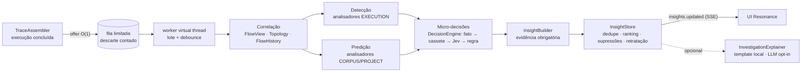

# Regras Assíncronas Preditivas — arquitetura, contratos e evolução

> Módulo `trace2local-predictive` · decisão em [ADR-013](adr/ADR-013-regras-assincronas-preditivas.md) ·
> micro-decisões em [ADR-011](adr/ADR-011-motores-de-micro-decisao-jev.md) · dever contínuo em [AGENTS.md](../AGENTS.md).
> Princípio: **um insight só existe se tiver evidência navegável — e nunca apresenta hipótese como fato.**

## 1. Arquitetura de partida (antes)

O Trace2Local montava a árvore da execução (TVEM), o delta de dados e a narrativa de negócio — **o que aconteceu**. Não havia: correlação entre execuções, baseline histórico, leitura de IaC/cobertura, nem um lugar para regras de diagnóstico. Logs não existiam como modelo. Consumidores assíncronos reais (Lambda via *event source mapping*) nasciam como execuções órfãs (corrigido na [ADR-014](adr/ADR-014-continuacao-tardia-assincrona.md)).

## 2. Oportunidades identificadas

| Sinal já disponível | O que permite antecipar |
|---|---|
| Segmentos da árvore (síncrono · espera em fila · consumidor · banco · externo) | **atribuição de latência** ponta a ponta (ex.: "98% do tempo está na fila") |
| Delta de dados EXACT (before/after) | sobrescrita sem guarda, duplicidade de efeito (idempotência) |
| Repetição de spans de banco | N+1, leituras redundantes |
| Acervo + histórico | regressão vs mediana, mudança de forma, tendência de erro, consumidor que parou |
| Logs/payloads/URLs | dado pessoal, segredo em log/URL |
| Projeto (Terraform, jacoco, pom/sonar, código) | deriva entre ambientes, segredo em IaC, cobertura < gate, ausência de timeout/retry |

## 3. Arquitetura proposta



## 4. Decisão registrada

[ADR-013](adr/ADR-013-regras-assincronas-preditivas.md) (pipeline, contratos, ranking, baseline) · [ADR-011](adr/ADR-011-motores-de-micro-decisao-jev.md) (Jev/determinístico/fusão) · [ADR-014](adr/ADR-014-continuacao-tardia-assincrona.md) (árvore assíncrona completa) · [ADR-015](adr/ADR-015-endurecimento-corporativo-ui-api.md) (egress só por POST).

## 5. Estrutura do módulo

```
trace2local-predictive/src/main/java/tech/neural7/trace2local/predictive/
├── api/          Insight · Evidence · PredictiveAnalyzer · AnalysisContext · InsightBuilder · Fmt
├── pipeline/     PredictivePipeline (fila, worker, timeouts) · PredictiveConfig
├── correlation/  FlowView (segmentos, caminho crítico, flowKey) · Topology (zonas) · Stats (mediana, MAD, z robusto)
├── analyzers/    12 analisadores built-in (+ ServiceLoader para plugins)
├── decision/     DecisionModel · DecisionEngine · JevHttpModel · JevCassetteModel · DeterministicJevModel
│                 QuestionCatalog · FusionPolicy · EgressSanitizer · IntelligenceConfig · TextFeatures
├── assistant/    ExecutionAssistant (laudo executivo + técnico) · StateBuilder
├── ranking/      InsightRanker · InsightStore (feedback persistido)
├── history/      FlowHistory (baseline por fluxo, persistido)
├── project/      ProjectScanner (regex, sem symlink, limites) · ProjectSnapshot
└── explain/      InvestigationExplainer (template local; LLM compatível com OpenAI opcional)
```

## 6. Pipeline assíncrono

- `submit(Execution)`: `ArrayBlockingQueue.offer` — **nunca bloqueia** a montagem; cheio ⇒ descarte contado (`dropped`). Medido: média **0,4–0,6 µs** e máximo de 0,7–3,7 ms (aquecimento de JIT/GC) com 20 000 submissões numa fila de 64 sob analisador lento — ~19 900 descartadas e contadas, **nenhuma bloqueada**.
- Worker em *virtual thread*: lotes, *debounce*, deduplicação por execução; analisadores em paralelo com semáforo e **timeout individual** (`TRACE2LOCAL_PREDICTIVE_ANALYZER_TIMEOUT_MS`).
- CORPUS com *debounce* (`corpus-debounce-ms`); PROJECT re-varrido quando o *fingerprint* de mtime muda.
- Status em `GET /api/intelligence` (fila, analisadas, descartes, timeouts, tempo médio por analisador, precisão por feedback).

## 7. Contratos

`GET /api/insights?limit=N` · `GET /api/executions/{id}/insights` (laudo + insights frescos + mapa nó→componente) · `GET /api/insights/{fp}/explain` (template) · `POST /api/insights/{fp}/explain {"llm":true}` · `POST /api/insights/{fp}/feedback {"action":"USEFUL|DISMISS|EXPECTED|MUTE|RESET"}` · `GET /api/topology` · `GET /api/history?flow=` · SSE `insights.updated`, `execution.merged`.

```json
{
  "id": "PERF-ASYNC-001", "fingerprint": "…", "category": "PERFORMANCE", "glyph": "⚡",
  "severity": "MEDIUM", "confidence": 0.8, "confidenceBand": "provável", "nature": "CORRELATION",
  "title": "Latência elevada no processamento assíncrono",
  "observation": "O fluxo order-processor leva 7,1 s de ponta a ponta; a espera entre publicação e consumo soma 6,9 s.",
  "correlation": "98,2% do tempo total está entre a publicação em orders-queue e o início do consumidor.",
  "hypothesis": "Possível backlog na fila ou intervalo de polling do consumidor.",
  "recommendations": ["Verificar a concorrência do consumidor…", "Verificar o batch size e o batching window…"],
  "evidence": [{"kind": "SEGMENT", "label": "espera em fila orders-queue → order-billing", "value": "6,9 s",
                "ref": {"executionId": "…", "nodeId": "…"}}],
  "affectedComponents": ["sqs:orders-queue", "lambda:order-billing"],
  "executionIds": ["…"], "occurrences": 2, "score": 0.71, "analyzer": "AsyncLatencyAnalyzer", "decidedBy": "jev-deterministic"
}
```

## 8. Catálogo inicial de regras

| id | categoria | escopo | sinal / regra | natureza |
|---|---|---|---|---|
| PERF-ASYNC-001 | ⚡ performance | execução | espera em fila domina o fluxo (fração + baseline de espera) | correlação |
| PERF-REG-001 | ⚡ performance | execução | p50 do fluxo acima do baseline (dia anterior × hoje ou janela; z robusto) | correlação |
| PERF-OUT-001 | ⚡ performance | execução | execução fora da distribuição do próprio fluxo (MAD) | correlação |
| DB-N1-001 | 🗄 dados | execução | N leituras irmãs com a mesma forma (N+1) | fato |
| DB-RED-001 | 🗄 dados | execução | mesma chave lida várias vezes na execução | fato |
| IDEM-001 | 🗄 dados | execução | criação sobrescreveu item existente sem guarda (before ≠ vazio) | fato |
| IDEM-002 | 🔁 resiliência | execução + acervo | mesmo consumidor aplicou efeito na mesma entidade em execuções distintas | correlação |
| RES-001 / RES-002 | 🔁 resiliência | execução + projeto | chamada externa sem timeout/retry/circuit breaker declarado · estouro de timeout | correlação |
| SEC-LOG-001 / SEC-PII-001 / SEC-URL-001 | 🔐 segurança | execução | dado sensível em log · PII em payload · segredo em URL | fato |
| ASYNC-ORPH-001 / PRED-CONS-001 | 🧠 predição | execução + acervo | publicação sem consumidor · consumidor que existia parou | correlação |
| ARCH-HOT-001 | ⚠ arquitetura | acervo | componente em muitos fluxos com latência/erro acima | correlação |
| PRED-ERR-001 / PRED-SHAPE-001 | 🧠 predição | acervo | tendência de erro crescente · mudança de forma do fluxo | hipótese/correlação |
| IAC-DRIFT-001 / IAC-SEC-001 | ☁ infraestrutura | projeto | divergência não intencional entre dev/hml/prod · segredo em Terraform | correlação/fato |
| TEST-COV-001 | 🧪 testes | projeto | cobertura (jacoco) abaixo do gate (pom `jacoco:check`, sonar ou `TRACE2LOCAL_QUALITY_GATE_COVERAGE`) | fato |

Todas **promovidas** (passaram no benchmark com controles). Novas regras seguem o processo da seção 19.

## 9. Estratégia JEV + agentes + LLM

- **Regra determinística** decide o que é verificável por estrutura (fatos, contagens, limiares estatísticos).
- **Jev (modelos pequenos)** decide micro-classificações semânticas onde mediu ganho (classe de log, papel do passo) e opina com meia voz em notas numéricas; é **opt-in**, com egress estrutural, orçamento e disjuntor.
- **LLM** só **explica** um insight já formado (nunca detecta), opcional, preferencialmente local (Ollama); externo exige `TRACE2LOCAL_LLM_ALLOW_EXTERNAL=true` e POST.
- **Agentes**: fora do caminho do produto; o dever de evolução contínua está no [AGENTS.md](../AGENTS.md) (quem altera regras mede antes).

## 10. Modelo de confiança

`confidence ∈ [0,1]` vem do analisador (força estatística/sinal) e pode ser reduzida pela micro-decisão (`decidedBy`). Faixas na UI: **≥ 0,999 + FATO = fato observado** · **≥ 0,90 forte evidência** · **≥ 0,75 provável** · **≥ 0,55 atenção** · abaixo **hipótese fraca**. A natureza (`FACT`/`CORRELATION`/`HYPOTHESIS`) é independente da confiança e aparece em blocos separados (FATO OBSERVADO · CORRELAÇÃO · HIPÓTESE · RECOMENDAÇÕES).

## 11. Modelo de ranking

`score = 1 − e^(−3·bruto)`, `bruto = impacto(categoria) × peso(severidade) × confiança × (1 + ln(ocorrências)/3) × criticidade do fluxo [0,5–1,2] × novidade [0,6–1] × precisão do analisador [0,2–1]`. Impacto: segurança 1,0 · dados/resiliência 0,9 · predição/performance 0,8 · infra/arquitetura 0,7 · testes 0,6. Pesos de severidade: INFO 0,15 · LOW 0,35 · MEDIUM 0,6 · HIGH 0,85 · CRITICAL 1,0. Precisão do analisador = Beta(3,1) atualizada por ÚTIL/DESCARTAR.

**Supressões:** `MUTE` (sempre) · `EXPECTED` (7 dias) · `DISMISS` (24 h ou até a severidade subir) · `RESET`. **Retratação:** a re-análise da mesma execução retira achados por-execução que ela não sustenta mais.

## 12. Histórico e baseline

`FlowHistory` guarda, por `flowKey` (componente raiz + `[falha]`), até N amostras: total, espera em fila, banco, chamadas, nós, erros, forma (hash), componentes, produtores consumidos. Comparação: **dia anterior × hoje** quando há amostras suficientes, senão **janela** (últimas × anteriores). Persistência em `.trace2local/history/flows.json` (sobrevive à limpeza do acervo; `TRACE2LOCAL_HISTORY=off` desliga). UI: Painel → *Histórico por fluxo* com sparkline e Δ%.

## 13. Segurança e privacidade

Local-first: sem configuração explícita **nada sai da máquina**. Com Jev: só estado estrutural redigido (sem payload, sem valores, hosts pseudonimizados, IPs privados mascarados), HTTPS, sem redirect, chave só por ambiente (`toString` mascarado), orçamento diário. LLM: opt-in, externo bloqueado por padrão, só por POST. `ProjectScanner`/`InfraIndexer`: regex, sem seguir symlink, limites de profundidade/arquivos/bytes, segredos mascarados. Detalhes: [SEGURANCA-CORPORATIVA.md](SEGURANCA-CORPORATIVA.md).

## 14. Apresentação na UI

- Marcadores ⚡⚠🔐🧪☁🔁🧠🗄 nos cartões de execução, nos passos da árvore e nos componentes da Anatomia.
- Painel lateral **INSIGHTS** ranqueado → **insight em foco** com FATO · CORRELAÇÃO · HIPÓTESE · RECOMENDAÇÕES, barra de confiança e faixa, **[Ver evidências] [Ver trace] [Ver histórico] [Explicar]** e feedback (útil · falso positivo · esperado · silenciar).
- Telas: [docs/qa/screenshots/v3-ressonancia](qa/screenshots/v3-ressonancia/) (11, 12, 13).

## 15. Testes

| teste | o que garante |
|---|---|
| `PredictiveBenchmarkTest` | 35 cenários (15 controles) — precisão/recall por regra, 0 FP em controle, Evidence First, submit O(1) |
| `RealTraceRegressionTest` | traces **reais** do LocalStack: árvore assíncrona completa, rodada limpa sem IDEM, reprocessamento com IDEM-001/002, guarda protegida sem achado, desfechos lidos corretamente |
| `JevMicroDecisionBenchmarkTest` | 106 itens rotulados — determinístico × Jev × cascatas × política (replay offline em CI) |
| `RealTraceJevLiveCheckTest` | Jev ao vivo sobre traces reais (só com chave) |
| `DecisionEngineTest` · `InsightStoreTest` | sanitização de egress, fallback em falha de autenticação, disjuntor, cassete, supressões |

## 16–17. Benchmark e métricas

- [docs/qa/BENCHMARK-PREDITIVO.md](qa/BENCHMARK-PREDITIVO.md): precisão **1,00**, recall **1,00**, **0** FP em 15 controles (inclui os controles `before = {}`, SQL parametrizado inferido e dado pessoal já mascarado, vindos dos casos reais).
- [docs/qa/BENCHMARK-JEV.md](qa/BENCHMARK-JEV.md): política do produto **0,96** (determinístico 0,92 · Jev 0,78).
- [docs/qa/REAL-TRACES-JEV.md](qa/REAL-TRACES-JEV.md): Jev ao vivo em 12 execuções reais — 0 falhas, ~250 ms/lote, ~US$ 0,001.
- [docs/qa/VALIDACAO-CASOS-REAIS.md](qa/VALIDACAO-CASOS-REAIS.md): achados do caso real e correções.

## 18. Estado da implementação

Implementado e testado: pipeline, 12 analisadores (20 regras), ranking/feedback/supressões/retratação, baseline persistido, motor de decisão com Jev opt-in + cassete + determinístico, laudo executivo/técnico, explicação local/LLM opcional, integração completa na UI e no SSE. **Limites declarados:** análise de projeto por regex (sem AST), cobertura só via jacoco.xml, confiança do Jev não calibrada, tail de CloudWatch apenas para LocalStack.

## 19. Evolução contínua

O processo de promoção experimental (hipótese → cenário injetado + controle → medição → decisão) e os 14 deveres contínuos estão no [AGENTS.md](../AGENTS.md#predictive-async-rules--continuous-evolution).

## 20. Roadmap

1. **Fronteira externa**: anel externo já existe na Anatomia; próximo passo é catalogar contratos de parceiros (OpenAPI) e SLOs por host.
2. Veredito de regra decomposto em afirmações atômicas `noul` para o Jev (onde ele hoje erra).
3. Análise de projeto por AST (JavaParser) para resiliência/idempotência no código.
4. Importação de `.tvtrace` no Station (os traces reais já são reproduzíveis por `ExecutionJson`).
5. Calibração de confiança (Platt/isotônica) com o feedback acumulado.
6. Assinatura SigV4 opcional no tail de CloudWatch para contas *sandbox* corporativas.
