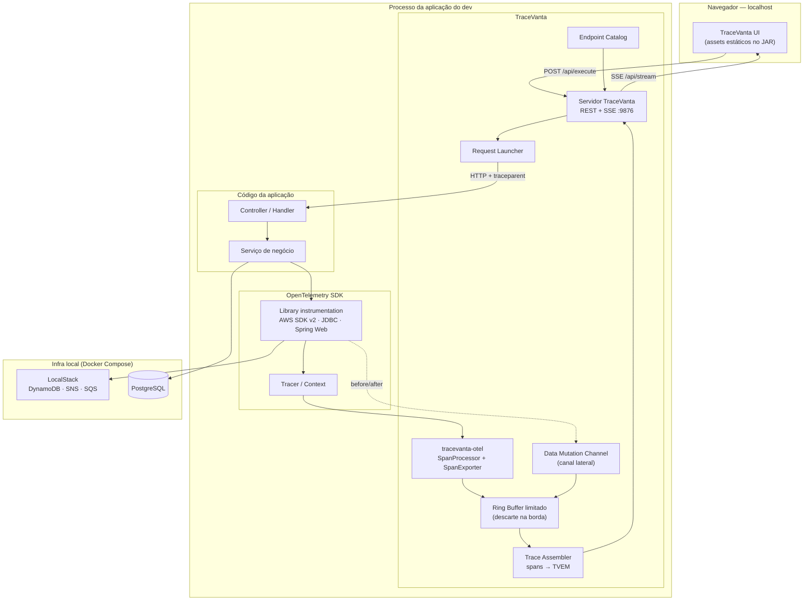

# TraceVanta — Especificação Técnica e Arquitetural

> **Versão:** 1.0.0 · **Status:** GATE 1 **aprovado** (ver `docs/adr/GATE-1-DECISOES.md`) — implementação em andamento · **Data:** 2026-09-18
> **Autor:** Thiago Gonçalo (Neural7 Tech) · elaborada pelo pipeline gated da Squad AI
> **Tagline:** *TraceVanta — See your request travel through the system.*
> **Substitui:** `tracevanta-spec.md` v1.0.0-PROPOSAL (parcial, interrompida na seção 3; renomeada no GATE 1, decisão D-5)

---

## 0. Como ler este documento

| Seção | Para quem |
| :--- | :--- |
| 1–3 | Produto: problema, posicionamento, escopo do MVP |
| 4–6 | Engenharia: arquitetura, modelo de dados, contratos |
| 7–10 | Qualidade: RNFs, segurança, AOT, testes |
| 11–14 | Execução: roadmap, riscos, decisões em aberto |

**Convenções normativas (RFC 2119):** **DEVE** / **NÃO DEVE** = obrigatório; **DEVERIA** = recomendado forte; **PODE** = opcional.

**Rastreabilidade:** toda afirmação técnica sobre biblioteca de terceiro tem fonte primária em `docs/PESQUISA-2026-09-18.md`. Nenhum número neste documento é estimativa disfarçada de medição — o que não foi medido está marcado como `[A MEDIR]`.

---

## 1. Visão do produto

### 1.1 O problema

No desenvolvimento local de arquiteturas distribuídas (Docker Compose + LocalStack + Lambda), depurar um fluxo ponta a ponta exige alternar entre terminais de log, cliente de banco, console do LocalStack, `aws` CLI e, quando existe, um APM pesado. O desenvolvedor perde o fio da execução exatamente no ponto em que ela sai do seu código: quando vira uma chamada ao DynamoDB, um `Publish` no SNS ou uma mensagem que some dentro de uma fila.

Três lacunas concretas, que nenhuma ferramenta resolve junta:

1. **Disparo e observação estão separados.** O Postman dispara, o Jaeger observa — e o dev faz a ponte mentalmente, copiando trace-ids entre janelas.
2. **A infraestrutura aparece como span opaco.** `DynamoDb.PutItem 12ms` diz que houve uma escrita, não *o que mudou*.
3. **O assíncrono quebra a narrativa.** SNS → SQS → Lambda vira três traces órfãos em três abas.

### 1.2 A solução

O **TraceVanta** é uma biblioteca Java plugável via Maven que atua como *runtime canvas* interativa para o desenvolvedor. Ergonomia do **Swagger UI** — adicione a dependência, suba a aplicação, abra `http://localhost:9876/tracevanta` — expandida para cobrir **tracing distribuído, jornada de dados e infraestrutura local**: descobre endpoints, dispara a requisição do navegador e desenha ao vivo o caminho percorrido pelo código, bancos, filas e tópicos.

### 1.3 Princípios norteadores

1. **Zero-Configuration.** Uma dependência, zero linhas de configuração para o caso comum.
2. **Local-First & Privacy by Design.** Nenhum byte sai da máquina do desenvolvedor. Bind exclusivo em loopback, sem telemetria de uso, sem *phone home*.
3. **AOT-First.** Sem `-javaagent`, sem transformação de bytecode em runtime, sem geração opaca de proxy. Reflexão apenas **catalogada em build time** (ver §9 — a promessa honesta não é "zero reflexão").
4. **Sem sobrecarga crítica.** Coleta desacoplada por fila limitada; o caminho de requisição do usuário nunca bloqueia por causa do TraceVanta. Descarte é preferível a espera.
5. **Visibilidade semântica.** Não spans desconexos, mas uma árvore viva que correlaciona regra de negócio a mutação de infraestrutura.
6. **Dev-time, não produção.** TraceVanta **NÃO DEVE** ser empacotado em artefato de produção; o starter falha o boot em perfil produtivo (§8.4).

### 1.4 Não-objetivos (escopo negativo explícito)

O TraceVanta **NÃO** é, e não pretende virar:

| Não é | Por quê |
| :--- | :--- |
| APM de produção | Retenção em memória, sem storage durável, sem multi-tenancy, sem RBAC |
| Substituto de Jaeger/Zipkin/X-Ray | É complementar: exporta OTLP para eles quando o dev quiser (§4.4) |
| Profiler de CPU/alocação | Glowroot e JFR já fazem isso muito melhor |
| Ferramenta de carga/stress | Um disparo por vez, por design |
| Cliente de API genérico | Só dispara o que ele mesmo descobriu na aplicação instrumentada |

### 1.5 Personas e jornadas

**P1 — Dev Java em ciclo de codificação (persona primária).** Acabou de escrever um endpoint que grava no DynamoDB e publica no SNS. Quer saber, em segundos, se gravou o que achava que gravava.

> *Jornada crítica (JC-1):* sobe a app → abre a UI → vê `POST /orders` no catálogo → edita o JSON de exemplo → dispara → vê a árvore crescer em tempo real → clica no nó DynamoDB → lê o `before/after` do item. **Sem sair do navegador, sem `aws dynamodb scan`.**

**P2 — Dev depurando falha intermitente.** A requisição volta 500 e o log diz `ConditionalCheckFailedException`. Quer ver qual condição e qual item.

> *Jornada (JC-2):* localiza a execução vermelha em "Recent Executions" → abre o nó que falhou → inspeciona request/response bruto da chamada AWS e a exceção com stack.

**P3 — Dev integrando fluxo assíncrono.** Publicou no SNS e a Lambda consumidora não rodou.

> *Jornada (JC-3):* vê a árvore terminar em `SNS: order-events` sem o filho `SQS: billing-queue` → o TraceVanta marca o ramo como **órfão aguardando consumo** e mostra por quanto tempo.

**P4 — Tech lead em code review / onboarding.** Quer mostrar para alguém o que o serviço realmente faz.

> *Jornada (JC-4):* dispara o endpoint, exporta o trace como arquivo `.tvtrace` e anexa no PR.

---

## 2. Arte prévia e posicionamento

Levantamento verificado em 2026-09-18 (fontes em `docs/PESQUISA-2026-09-18.md`).

| Ferramenta | O que faz | Onde difere do TraceVanta |
| :--- | :--- | :--- |
| **Glowroot** (Apache-2.0, ativo) | `-javaagent` + UI embutida em `localhost:4000`, call tree com timing, storage H2 local | **O vizinho mais próximo em arquitetura.** Mas é profiler passivo: não tem catálogo de endpoints clicável, não dispara requisição, não cruza serviço, não mostra delta de dados. E é agente — incompatível com Native Image |
| **Jaeger all-in-one / Zipkin** | Binário único com collector + UI, recebe OTLP | Processo separado; você empurra telemetria nele. Sem catálogo, sem disparo, sem delta |
| **otel-desktop-viewer / otel-gui / otel-tui** | Visualizadores OTLP locais (2025–2026) | Mesma categoria acima: recebem, não instrumentam nem disparam |
| **Digma** | Plugin de IDE correlacionando código a runtime OTel | A superfície é o editor, não uma UI embutida no serviço |
| **Spring Boot Actuator `httpexchanges`** | Últimas 100 trocas HTTP em memória | O próprio Spring documenta que **não** é tracing: sem body, sem UI, sem DAG |
| **Swagger UI / springdoc** | Catálogo de endpoints + disparo | Para no `200 OK`. Nada do que acontece depois |
| **Postman** | Disparo isolado | Zero visão de runtime |

**Conclusão honesta da pesquisa:** não foi encontrada nenhuma biblioteca Java que combine as três coisas — *UI embutida no próprio JAR* + *catálogo clicável com disparo* + *DAG cross-serviço ao vivo com delta de dados*. O nicho está aberto, mas **"agente Java com UI local embutida" já existe (Glowroot)** — o diferencial do TraceVanta precisa ser dito nesses três termos, nunca como "UI local de tracing", que não é novidade.

### 2.1 Matriz de posicionamento

| Critério | Swagger UI | Jaeger/Zipkin | Glowroot | Postman | **TraceVanta** |
| :--- | :--- | :--- | :--- | :--- | :--- |
| Ponto de partida | Contrato estático | Telemetria passiva | Agente passivo | Disparo isolado | **Disparo ativo + tracing imediato** |
| Visão de infraestrutura | Nula | Spans genéricos | JDBC/HTTP | Nenhuma | **Árvore viva (DynamoDB, SQS, SNS, JDBC)** |
| Mutação de estado | Nenhuma | Nenhuma | Nenhuma | Nenhuma | **Delta before/after (§4.10)** |
| Setup | Dependência | Daemon + portas | Agente + JVM flag | App desktop | **Dependência (embedded) ou 1 container (companion)** |
| GraalVM Native | Sim | N/A | **Não (agente)** | N/A | **Sim, por design** |
| Persona | Consumidor de API | SRE | Dev/perf | QA | **Dev Java em debug local** |

---

## 3. Escopo da v0.1 (MVP)

Decidido no GATE 0 com o product owner (2026-09-18).

### 3.1 Dentro do escopo

| # | Capacidade | Critério de aceite (verificável) |
| :--- | :--- | :--- |
| E1 | Runtime Java 25 + Spring Boot 4.x, modo **Embedded** | App de exemplo sobe com a dependência e serve a UI em `localhost:9876/tracevanta` sem configuração |
| E2 | Modo **Companion** para AWS Lambda | `sam local invoke` de uma Lambda Java instrumentada aparece como trace na UI do TraceVanta Station |
| E3 | Descoberta de endpoints HTTP | 100% dos `@RequestMapping` da app de exemplo listados, com schema de body quando disponível |
| E4 | Disparo de requisição pela UI | Requisição sai com o `traceparent` do TraceVanta e a execução aparece na UI em < 1s |
| E5 | Canvas de execução (árvore) | Nós de HTTP, método de negócio anotado, DynamoDB, SNS, SQS e JDBC com latência individual |
| E6 | Inspector de nó | Operação, latência, status, atributos semânticos e payload bruto redigido |
| E7 | Delta de dados DynamoDB | `PutItem`/`UpdateItem`/`DeleteItem` exibem `before` e `after` (§4.10) |
| E8 | Correlação assíncrona SNS→SQS | Mensagem publicada e consumida no mesmo trace, com ramo órfão sinalizado |
| E9 | LocalStack como ambiente de referência | `docker-compose.yml` de exemplo sobe LocalStack + app + TraceVanta e a jornada JC-1 roda de ponta a ponta |
| E10 | Compatibilidade GraalVM Native Image | A app de exemplo compila nativa e a jornada JC-1 roda idêntica (§9) |
| E11 | Redaction por padrão | Campos sensíveis chegam à UI como `[TRACEVANTA_REDACTED]` sem configuração (§8.3) |
| E12 | Publicação open source no Maven Central | Artefatos assinados, Apache-2.0, com `-sources` e `-javadoc` |

### 3.2 Fora do escopo da v0.1 (com destino)

| Item | Versão-alvo | Razão |
| :--- | :--- | :--- |
| Quarkus | v0.3 | Um framework por vez; dobra a matriz de teste AOT |
| Kafka | v0.3 | Fora do conjunto AWS do protótipo |
| Visões DAG / Waterfall / Sequence / Business Journey | v0.2 | A árvore entrega a jornada crítica; as outras visões são leitura alternativa do mesmo modelo |
| S3, RDS/Aurora nativo, Step Functions, EventBridge | v0.2–v0.3 | Cobertos parcialmente pelo span genérico do AWS SDK |
| Lambda Managed Instances (JVM persistente) | v0.3 | GA em nov/2025; permite modo Embedded em Lambda, mas amplia a matriz |
| Replay / "disparar de novo com este payload" | v0.2 | Depende de persistência de execução |
| Exportação OTLP para Jaeger/Tempo | v0.2 | Trivial tecnicamente, mas não é a jornada crítica |
| Persistência em disco dos traces | v0.2 | v0.1 é 100% memória (§7.3) |
| Autenticação | nunca (§8.1) | Loopback-only torna autenticação teatro de segurança |

### 3.3 Definição de pronto da v0.1

A v0.1 é declarada pronta quando, **em uma máquina limpa**, o comando `docker compose up` do repositório de exemplo permite executar as jornadas **JC-1, JC-2 e JC-3** sem consultar documentação além do README, **tanto em JVM quanto em binário nativo**, com os gates de qualidade de §10 verdes.

---

## 4. Arquitetura

### 4.1 Visão macro



Cinco responsabilidades, separadas por design:

| Bloco | Responsabilidade única |
| :--- | :--- |
| **Bridge OTel** | Traduzir span do OTel para o modelo TraceVanta. Não decide, não agrega |
| **Data Mutation Channel** | Carregar o que não cabe num span: payload bruto e delta de dados |
| **Ring Buffer** | Desacoplar o thread da requisição do trabalho de montagem. Descarta sob pressão |
| **Trace Assembler** | Montar a árvore a partir de eventos que chegam fora de ordem |
| **Servidor + UI** | Expor catálogo, disparar requisição, transmitir a árvore |

### 4.2 Os dois modos de execução

Esta é a decisão estrutural que mais amarra o desenho, e nasce de um fato do runtime da AWS: **uma Lambda clássica não tem processo de longa duração para hospedar uma UI** — o ambiente de execução congela entre invocações (ciclo Init → Invoke → Shutdown) e processos de background pausam junto. Ver [ADR-002](adr/ADR-002-dois-modos-de-execucao.md).

#### Modo A — Embedded (aplicações de longa duração)

```
[ JAR da app ] ── contém ──> [ TraceVanta core + UI + servidor :9876 ]
```

O TraceVanta vive dentro do processo. Disparo, coleta, montagem e UI no mesmo JVM. Zero infraestrutura extra. **Alvo:** Spring Boot local, `docker compose up`, testes de integração.

#### Modo B — Companion / Station (Lambda e processos efêmeros)

```
[ Lambda Java ] ──OTLP/HTTP──> [ tracevanta-station (container) :9876 ] ──SSE──> [ navegador ]
```

A função carrega apenas `tracevanta-lambda` (bridge + exporter, sem UI, sem servidor). O **Station** é um processo de longa duração — um container no mesmo `docker-compose.yml` do LocalStack — que recebe a telemetria, monta a árvore e serve a UI. **Alvo:** `sam local invoke`, `sam local start-api`, LocalStack Lambda.

| Aspecto | Embedded | Companion |
| :--- | :--- | :--- |
| Onde roda a UI | No JVM da app | No container Station |
| Custo de startup | Sem processo extra | +1 container (~40 MB RSS `[A MEDIR]`) |
| Disparo de requisição | Chama a própria app | Chama o endpoint local do SAM/LocalStack |
| Flush da telemetria | Assíncrono contínuo | **Síncrono no fim da invocação** (obrigatório: o ambiente congela) |
| Multi-serviço | Um serviço por UI | **Vários serviços na mesma árvore** |

> O modo Companion é o que habilita a visão multi-serviço: dois microsserviços e uma Lambda apontando para o mesmo Station produzem **uma árvore**, não três. Por isso o Station **DEVE** existir já na v0.1, mesmo sendo o modo secundário.

#### Regra de flush em Lambda (crítica)

O exporter do modo Companion **DEVE** operar em `SimpleSpanProcessor` com flush bloqueante no encerramento do handler, com teto de tempo configurável (padrão **200 ms**) e descarte silencioso ao estourar. Um `BatchSpanProcessor` padrão perde telemetria: o ambiente congela antes do worker acordar. O wrapper `TraceVantaLambdaHandler` (§4.12) encapsula isso.

### 4.3 Módulos Maven

```
tracevanta/                        (pom agregador, groupId tech.neural7.tracevanta)
├── tracevanta-bom                 — BOM para o consumidor fixar versões
├── tracevanta-core                — TVEM, ring buffer, assembler, redaction, SPI. ZERO dependência de framework
├── tracevanta-otel                — ponte OTel: SpanProcessor, SpanExporter, mapeamento semântico
├── tracevanta-ui                  — assets da UI empacotados como WebJar (META-INF/resources)
├── tracevanta-server              — REST + SSE agnóstico de framework (sobre com.sun.net.httpserver no Station)
├── tracevanta-spring-boot-starter — autoconfiguração, catálogo de endpoints, launcher, RuntimeHints
├── tracevanta-aws                 — semântica AWS + captura de delta DynamoDB + correlação SNS→SQS
├── tracevanta-jdbc                — semântica SQL + captura de delta opt-in
├── tracevanta-lambda              — modo Companion: wrapper de handler, exporter, flush síncrono
├── tracevanta-station             — aplicação standalone (container) do modo Companion
└── tracevanta-testing             — JUnit 5 extension: asserções sobre a árvore em testes de integração
```

**Regras de dependência (verificadas por ArchUnit em CI):**

- `tracevanta-core` **NÃO DEVE** depender de Spring, AWS SDK, OTel ou qualquer framework. É POJO + JDK.
- Nenhum módulo **DEVE** depender de `tracevanta-spring-boot-starter`, exceto o consumidor final.
- `tracevanta-aws` e `tracevanta-jdbc` **DEVEM** declarar suas dependências pesadas como `provided` — quem não usa DynamoDB não baixa o SDK do DynamoDB.
- A UI **NÃO DEVE** referenciar nenhum host externo (CDN, fonte, telemetria). Verificado por teste que faz grep de `http` nos assets.

### 4.4 Pipeline de coleta

```
[instrumentação]──►[Bridge]──►[Ring Buffer]──►[Assembler]──►[Hub SSE]──►[navegador]
     thread da           não                  thread virtual        fan-out
     requisição       bloqueia                 dedicada             não-bloqueante
```

1. **Ingest (thread da requisição).** O `SpanProcessor` do TraceVanta recebe `onStart`/`onEnd`. O contrato do OTel é explícito: ambos são chamados **sincronamente na thread de execução e não devem bloquear**. Portanto o único trabalho permitido aqui é montar um evento imutável e oferecê-lo à fila.
2. **Ring Buffer.** `ArrayBlockingQueue` limitada (padrão **4096** eventos) com política `offer()` — **nunca `put()`**. Fila cheia ⇒ evento descartado e contador `tracevanta.dropped` incrementado, exibido na UI como aviso honesto ("N eventos descartados"). Ver [ADR-006](adr/ADR-006-ring-buffer-e-backpressure.md).
3. **Assembler (thread virtual dedicada).** Consome a fila, resolve parentesco por `spanId`/`parentSpanId`, aplica a camada semântica, funde os eventos do Data Mutation Channel e emite mutações do TVEM.
4. **Hub SSE.** Fan-out para os navegadores conectados, com coalescência: no máximo **20 frames/s** por trace, agregando mutações no intervalo.
5. **Exporter em cadeia (opcional).** O TraceVanta **NÃO DEVE** substituir o pipeline OTel do dev. Se já existe um `SpanExporter` configurado (OTLP para Jaeger, por exemplo), o TraceVanta se **acrescenta** como processor adicional.

> **Por que não LMAX Disruptor?** A spec original citava Disruptor. Uma `ArrayBlockingQueue` entrega o que precisamos (desacoplamento + descarte na borda) com zero dependência nova, e o Disruptor resolve um problema de throughput de milhões de eventos/s que uma ferramenta de debug local não tem. P1-Simplicidade vence. Se a medição (§7.1) mostrar contenção, reavaliar com número na mão — não antes.

### 4.5 Camada semântica (anti-corrupção)

Achado da pesquisa que dita este desenho: nas convenções semânticas do OpenTelemetry, os atributos de **banco de dados** estão **estáveis** (`db.system.name`, `db.operation.name`, `db.collection.name`, `db.query.text`), mas **toda a página de mensageria** (`messaging.*`) e **todos os atributos AWS** (`aws.dynamodb.*`, `aws.sqs.queue.url`, `aws.sns.topic.arn`) estão em **status Development** — podem mudar de nome em release menor.

Consequência normativa: **nenhum nome de atributo do OTel DEVE aparecer fora do módulo `tracevanta-otel`.** Existe uma única classe de mapeamento, versionada e testada:

```java
// tracevanta-otel
public interface SemanticMapper {
    Optional<NodeKind> kindOf(SpanData span);      // DYNAMODB, SQS, SNS, SQL, HTTP_SERVER...
    NodeLabel labelOf(SpanData span);              // "DynamoDB: orders"
    Map<String, String> inspectorFieldsOf(SpanData span);
}
```

O `SemanticMapper` **DEVE** ter teste de contrato por versão de semconv suportada e **DEVE** degradar para um nó genérico (`NodeKind.UNKNOWN`, rótulo derivado de `span.name`) quando não reconhecer — nunca falhar, nunca sumir com o nó.

### 4.6 Modelo de dados — TVEM (TraceVanta Execution Model)

O TVEM é o modelo público do produto. Ele **não** é o modelo do OTel: um span é um intervalo de tempo com atributos; um nó do TVEM é **algo que aconteceu com a execução**, e carrega o que o dev quer ver.

```java
public record Execution(
    String executionId,          // TV-88291 — identificador legível, exibido na UI
    String traceId,              // W3C trace id (32 hex)
    ExecutionStatus status,      // RUNNING, COMPLETED, FAILED, PARTIAL, ORPHANED
    Trigger trigger,             // como começou: UI_DISPATCH, EXTERNAL, LAMBDA_EVENT, TEST
    Instant startedAt,
    Duration duration,           // do início ao último nó fechado
    List<Node> roots,
    ExecutionMetrics metrics,    // nós, profundidade, spans perdidos, eventos descartados
    List<Warning> warnings       // honestidade: o que o TraceVanta não conseguiu ver
) {}

public record Node(
    String nodeId,               // = spanId quando origem OTel
    String parentId,             // null na raiz
    NodeKind kind,               // HTTP_SERVER, HTTP_CLIENT, BUSINESS, DYNAMODB, SQS, SNS, SQL, LAMBDA, UNKNOWN
    String label,                // "DynamoDB: orders"
    NodeStatus status,           // OK, ERROR, PENDING, ORPHANED
    Instant startedAt,
    Duration selfTime,           // tempo próprio, sem os filhos
    Duration totalTime,
    Map<String, String> attributes,   // já redigidos
    Payload payload,             // request/response brutos, redigidos e truncados (§4.10)
    DataMutation mutation,       // before/after, quando houver (§4.10)
    ErrorInfo error,             // tipo, mensagem, stack recortado
    List<Node> children
) {}

public record DataMutation(
    MutationKind kind,           // CREATE, UPDATE, DELETE, READ_ONLY
    String target,               // "orders" (tabela/coleção)
    String key,                  // "ORDER#88291"
    JsonNode before,             // null = item novo
    JsonNode after,
    List<FieldDelta> deltas,     // campos que mudaram, calculados pelo core
    MutationFidelity fidelity    // EXACT, INFERRED, UNAVAILABLE — honestidade de origem
) {}
```

Três invariantes do modelo, verificadas por teste de propriedade:

- **I1 — Toda execução é uma árvore, sempre.** Span órfão (pai perdido no descarte) é reparentado na raiz com `NodeStatus.ORPHANED`, nunca some.
- **I2 — Tempo próprio nunca é negativo.** `selfTime = totalTime − Σ(totalTime dos filhos sobrepostos)`, com piso em zero.
- **I3 — Fidelidade é declarada, não presumida.** Se o delta foi inferido (§4.10), o campo `fidelity` diz isso, e a UI mostra. O TraceVanta **NÃO DEVE** exibir dado inferido com aparência de dado observado.

### 4.7 SPI pública

Cinco pontos de extensão. Tudo além disso é interno e pode mudar sem aviso (regra de compatibilidade em §11.3).

```java
public interface TraceVantaExtension {                 // ServiceLoader, AOT-safe
    default void contribute(NodeBuilder node, SpanData span) {}
    default Optional<DataMutation> captureMutation(MutationContext ctx) { return Optional.empty(); }
    default RedactionPolicy redactionPolicy() { return RedactionPolicy.INHERIT; }
    default List<EndpointDescriptor> discoverEndpoints() { return List.of(); }
    default int order() { return 0; }
}
```

Registro por `META-INF/services` (`ServiceLoader`) — funciona em Native Image quando o serviço é declarado, ao contrário de varredura de classpath. Os módulos `tracevanta-aws` e `tracevanta-jdbc` são, eles próprios, implementações desta SPI: **o núcleo não conhece AWS**.

### 4.8 Descoberta de endpoints

**Spring (modo Embedded).** `RequestMappingHandlerMapping.getHandlerMethods()` — a mesma API que o `/actuator/mappings` usa internamente. Funciona em Native Image porque o AOT do Spring Boot **gera as definições em build time**; a chamada apenas lê o grafo já materializado.

**Schema do corpo (para pré-preencher o JSON, como no protótipo).** Três estratégias em cascata, primeira que responder vence:

1. **springdoc/OpenAPI presente** → usa o schema que ele já produziu. Melhor resultado, custo zero.
2. **Sem springdoc** → introspecção do tipo do parâmetro `@RequestBody` via `RecordComponent` (records: sem reflexão sobre campos privados) ou via Jackson `ObjectMapper` com hints registrados.
3. **Falhou** → corpo vazio editável, com aviso na UI. **Nunca** um schema inventado.

> **Nota de honestidade técnica:** a estratégia 2 usa reflexão. Em Native Image ela só funciona com os tipos **registrados em build time** pelo `RuntimeHintsRegistrar` do starter. É por isso que o princípio §1.3 diz "reflexão catalogada", e não "zero reflexão" — é exatamente o que o springdoc faz, e ele tem bug aberto com GraalVM 25 justamente aqui. Ver [ADR-005](adr/ADR-005-empacotamento-ui-e-runtime-hints.md) e §9.

**Lambda (modo Companion).** Não há `HandlerMapping`. O catálogo vem de: (a) parse do `template.yaml` do SAM quando presente no diretório montado, (b) registro explícito via `@TraceVantaEndpoint` no handler, (c) fallback: catálogo vazio e a UI vira somente-observação (ainda útil — a árvore aparece quando o dev dispara pelo `sam local`).

### 4.9 Request Launcher

```
POST /api/execute
{ "endpointId": "post:/orders", "headers": {...}, "body": {...}, "pathVariables": {...} }
→ 202 { "executionId": "TV-88291", "traceId": "4bf92f..." }
```

Regras:

- O launcher **DEVE** gerar um contexto W3C novo e injetar `traceparent`, para que a execução seja atribuível ao disparo — é isso que faz o clique aparecer na árvore em menos de um segundo.
- Adiciona `tracevanta.trigger=ui` como baggage, permitindo ao dev filtrar disparos próprios de tráfego real.
- Alvo **DEVE** ser restrito a loopback e à porta da própria aplicação (modo Embedded) ou ao endpoint local configurado (modo Companion). **NÃO DEVE** aceitar URL arbitrária — senão o TraceVanta vira um SSRF com UI bonita. Ver §8.2.
- Um disparo por vez por sessão de UI; o segundo clique cancela o anterior na visualização, nunca no servidor.

### 4.10 Delta de dados — o diferencial, e seu preço honesto

Este é o recurso que nenhuma ferramenta da §2 tem, e é também o mais delicado. **Um fato da pesquisa decide o desenho:** no OpenTelemetry, `SpanProcessor.onStart` recebe um `ReadWriteSpan` (mutável), mas `onEnd` recebe um `ReadableSpan` — **somente leitura**. Não é possível enriquecer o span com o resultado da operação depois que ela terminou. Logo, **o delta de dados não pode viver dentro do span**. Ver [ADR-003](adr/ADR-003-canal-lateral-de-mutacao-de-dados.md).

Solução: **Data Mutation Channel** — canal lateral que emite eventos correlacionados por `spanId`, fundidos pelo Assembler:

```java
record MutationEvent(String spanId, String traceId, DataMutation mutation, Instant at) {}
```

#### DynamoDB — fidelidade EXACT

Captura via `ExecutionInterceptor` do AWS SDK v2 (o mesmo mecanismo da instrumentação OTel, registrado manualmente — sem agente):

| Operação | `before` | `after` | Fidelidade |
| :--- | :--- | :--- | :--- |
| `PutItem` | `ReturnValues=ALL_OLD` na resposta | o item enviado | EXACT |
| `UpdateItem` | `ReturnValues=ALL_OLD` | `ReturnValues=ALL_NEW`, 2ª chamada não necessária | EXACT |
| `DeleteItem` | `ReturnValues=ALL_OLD` | `null` | EXACT |
| `GetItem`/`Query` | — | itens retornados (truncados) | READ_ONLY |
| `TransactWriteItems` | não suportado na v0.1 | — | UNAVAILABLE |

> ⚠️ **Efeito colateral declarado:** para obter o `before`, o interceptor **modifica a requisição** do desenvolvedor, elevando `ReturnValues` de `NONE` para `ALL_OLD`. Isso muda o consumo de capacidade de escrita e, em tese, pode mudar o comportamento do código do dev se ele inspecionar a resposta. Por isso: (a) a elevação **DEVE** ser desligável (`tracevanta.aws.dynamodb.capture-before=false`), (b) **DEVE** estar documentada em letra grande no README, (c) o TraceVanta **DEVE** devolver ao código da aplicação a resposta **sem** os atributos que ele próprio pediu, restaurando a semântica original. Esta é a decisão mais arriscada da spec — está isolada no ADR-003 para poder ser revertida sem tocar no resto.

#### SQL/JDBC — fidelidade INFERRED ou opt-in

Não existe `ReturnValues` em SQL. Três níveis, configuráveis:

1. **`off`** (padrão): sem delta, apenas `db.query.text` redigido e `updateCount`.
2. **`inferred`**: o core deriva a intenção do SQL (parse leve de `INSERT`/`UPDATE`/`DELETE` + tabela + cláusula `WHERE`) e exibe com `fidelity=INFERRED`, sem tocar no banco.
3. **`before-image`** (opt-in explícito, com aviso): antes de um `UPDATE`/`DELETE`, o TraceVanta executa um `SELECT` correspondente na **mesma conexão e transação**. Captura exata, mas **altera o custo e a contenção da transação do dev** — por isso nunca é padrão.

#### Payload bruto

Request/response de cada nó são capturados truncados em **8 KB** por padrão (`tracevanta.payload.max-bytes`), redigidos antes de sair do processo de origem (§8.3), e nunca persistidos em disco na v0.1.

### 4.11 Propagação de contexto

| Caminho | Mecanismo | Status |
| :--- | :--- | :--- |
| HTTP entrada/saída | W3C `traceparent` (padrão OTel) | Sólido |
| DynamoDB / chamadas AWS | Span de client do `opentelemetry-aws-sdk-2.2` | Sólido |
| **SNS → SQS** | `AWSTraceHeader` (atributo de sistema, **não consome** um dos 10 atributos de usuário do SQS); injeção W3C em atributo de usuário é **experimental** no OTel e **não cobre `SNS.PublishBatch`** | **Best-effort declarado** |
| SQS → consumidor | Extração no `receiveMessage`, criando `Link` para o span produtor | Sólido |
| Lambda | Contexto do evento + `traceparent` propagado pelo wrapper | Sólido |
| **Virtual threads** | `Context` do OTel é `ThreadLocal`; **`Thread.startVirtualThread` não herda contexto** (issue oficial fechada como *not planned*) | **Armadilha documentada** |

Sobre a última linha: o TraceVanta **DEVE** fornecer `TraceVantaThreadFactory`, que captura `Context.current()` no fork e reabre o escopo na thread nova, e **DEVE** detectar ramos com pai ausente marcando-os `ORPHANED` com a mensagem *"contexto possivelmente perdido em thread não instrumentada"* — em vez de silenciosamente desenhar uma árvore errada.

Sobre `ScopedValue`: é **final** no Java 25 (JEP 506) e é o mecanismo idiomático para contexto imutável, com herança automática dentro de `StructuredTaskScope`. **Mas** não propaga para pools de threads de plataforma clássicos, e `StructuredTaskScope` ainda é **preview** (JEP 505) no Java 25 — uma biblioteca que outros embutem **NÃO DEVE** exigir `--enable-preview`. Decisão: `ScopedValue` é usado **internamente** pelo TraceVanta para carregar o `executionId` do disparo; a propagação de trace continua sendo a do OTel `Context`. Ver [ADR-009](adr/ADR-009-baseline-jdk-e-matriz-de-suporte.md).

### 4.12 Wrapper de Lambda

```java
public abstract class TraceVantaLambdaHandler<I, O> implements RequestHandler<I, O> {
    @Override public final O handleRequest(I input, Context ctx) {
        return TraceVantaRuntime.around(ctx, () -> handle(input, ctx));  // abre span raiz, flush no fim
    }
    protected abstract O handle(I input, Context ctx);
}
```

Alternativa sem herança, para quem não pode trocar a classe base: `TraceVantaRuntime.instrument(handler)` como decorator. Ambas **DEVEM** garantir o flush síncrono de §4.2.

---

## 5. Contratos de API

Prefixo único: `/tracevanta` (UI) e `/tracevanta/api` (dados). Configurável por `tracevanta.base-path`.

### 5.1 REST

| Método | Rota | Resposta |
| :--- | :--- | :--- |
| `GET` | `/api/meta` | `{ app, runtime, mode, version, capabilities[] }` — a UI se adapta ao que existe |
| `GET` | `/api/endpoints` | `[{ endpointId, method, path, handler, requestSchema, sampleBody }]` |
| `POST` | `/api/execute` | `202 { executionId, traceId }` (§4.9) |
| `GET` | `/api/executions?limit=50` | Lista resumida (o painel "Recent Executions") |
| `GET` | `/api/executions/{id}` | `Execution` completa em JSON |
| `GET` | `/api/executions/{id}/export` | Arquivo `.tvtrace` (JSON + manifesto de versão) |
| `DELETE` | `/api/executions` | Limpa o buffer em memória |
| `GET` | `/api/health` | `{ status, dropped, bufferUsage, connectedClients }` |

### 5.2 Stream (SSE)

```
GET /api/stream            Accept: text/event-stream
```

**Um único `EventSource` por aba**, multiplexando todos os tipos de evento. Isso não é detalhe de implementação: o navegador limita **6 conexões TCP por origem em HTTP/1.1**, e um stream aberto ocupa uma delas permanentemente — abrir um stream por painel satura o limite e trava a própria aplicação do dev. Ver [ADR-004](adr/ADR-004-transporte-sse.md).

```
event: execution.started
data: {"executionId":"TV-88291","traceId":"4bf9...","trigger":"ui","at":"..."}

event: node.upserted
data: {"executionId":"TV-88291","node":{ ...Node parcial... }}

event: node.mutation
data: {"executionId":"TV-88291","nodeId":"a1b2","mutation":{ ...DataMutation... }}

event: execution.completed
data: {"executionId":"TV-88291","status":"COMPLETED","duration":"PT0.042S","metrics":{...}}

event: system.warning
data: {"kind":"EVENTS_DROPPED","count":137,"message":"Buffer cheio; a árvore pode estar incompleta"}
```

Regras: `id:` monotônico por execução para permitir `Last-Event-ID` na reconexão automática do `EventSource`; `retry: 2000`; heartbeat de comentário a cada 15 s para atravessar proxies; coalescência de no máximo 20 frames/s por execução (§4.4).

### 5.3 Ingest do Station (modo Companion)

O Station aceita **OTLP/HTTP** padrão em `/v1/traces` — assim qualquer serviço já instrumentado com OTel aponta para ele sem código do TraceVanta — **mais** o endpoint proprietário `/tvingest/v1/mutations` para o Data Mutation Channel, que não tem equivalente em OTLP. Um serviço que envie apenas OTLP aparece na árvore **sem** delta de dados — degradação prevista, não erro.

### 5.4 Configuração

Propriedades com prefixo `tracevanta.`, resolvidas na ordem: propriedade de sistema > variável de ambiente > `application.yml` > padrão.

| Propriedade | Padrão | Nota |
| :--- | :--- | :--- |
| `enabled` | `true` em dev, `false` caso contrário | §8.4 |
| `port` | `9876` | `0` = mesma porta da app |
| `bind-address` | `127.0.0.1` | §8.1 — alterar exige `allow-non-loopback=true` |
| `buffer.capacity` | `4096` | eventos |
| `retention.max-executions` | `100` | LRU em memória |
| `payload.max-bytes` | `8192` | por nó |
| `redaction.mode` | `strict` | `strict` \| `keys` \| `off` (§8.3) |
| `aws.dynamodb.capture-before` | `true` | §4.10 — efeito colateral declarado |
| `jdbc.mutation-capture` | `off` | `off` \| `inferred` \| `before-image` |
| `station.endpoint` | — | modo Companion |
| `flush-timeout-ms` | `200` | Lambda |

---

## 6. Interface

### 6.1 Layout (fiel ao protótipo `traceventa-prototipo.jpeg`)

```
┌──────────────────────────────────────────────────────────────────────────────┐
│ TRACEVANTA  │ ENVIRONMENT: localstack (dev) │ APP: order-service │ ● CONNECTED│
├───────────────────────┬──────────────────────────────────────────────────────┤
│ DISCOVERED ENDPOINTS  │ EXECUTION CANVAS: Trace #TV-88291                     │
│  ▾ POST /orders       │                                                       │
│    { "customerId":…}  │        (External Client) ──HTTP 201│42ms──▶           │
│  [▶ EXECUTE REQUEST]  │              │                                        │
│                       │       ┌──────▼────────────┐   PutItem(12ms)  ┌──────┐ │
│ RECENT EXECUTIONS     │       │ OrderApplication  │─────────────────▶│Dynamo│ │
│  ● TV-88291 201 42ms  │       │  ├ Validate       │   Publish(8ms)   ├──────┤ │
│  ● TV-88290 400 11ms  │       │  └ CreateOrder    │─────────────────▶│ SNS  │ │
│  ● TV-88289 500 18ms  │       └───────────────────┘                  └──┬───┘ │
│                       │                                      (Fanout)   ▼     │
│                       │                                             [ SQS ]   │
├───────────────────────┴──────────────────────────────────────────────────────┤
│ INSPECTOR PANEL: DynamoDB: orders                                            │
│ Operation: PutItem │ Latency: 12ms │ Status: ✓ SUCCESS │ PK: ORDER#88291      │
│ Data mutation — Before: null (New Item)                                      │
│                 After:  {"orderId":"88291","total":250.00,…}  [REDACTED]     │
└──────────────────────────────────────────────────────────────────────────────┘
```

### 6.2 Requisitos de UI

- **Sem build step obrigatório para o consumidor.** Assets pré-compilados no WebJar; o dev nunca roda `npm`.
- **Offline absoluto.** Zero requisição externa: sem CDN, sem Google Fonts, sem source map remoto. Verificado por teste (§4.3).
- **Orçamento de bundle: 400 KB gzip.** Grafo com `d3-hierarchy` (ISC, ~6 KB gzip) para a árvore + SVG próprio. `Cytoscape.js` (MIT, ~137 KB) entra apenas se a visão DAG da v0.2 exigir, e ELK.js (~433 KB, EPL-2.0/GPL) fica fora por peso e licença.
- **Estados honestos.** Toda degradação aparece: eventos descartados, ramo órfão, delta indisponível, schema não inferido. A UI **NÃO DEVE** esconder o que o TraceVanta não viu.
- **Tema escuro como padrão**, contraste AA, navegação por teclado no canvas.

---

## 7. Requisitos não-funcionais

### 7.1 Performance

| ID | Requisito | Verificação |
| :--- | :--- | :--- |
| NFR-1 | Overhead p95 de latência da requisição instrumentada **< 5%** vs. baseline sem TraceVanta | JMH + teste de integração comparativo em CI, 3 execuções, mediana |
| NFR-2 | `onStart`/`onEnd` do processor: **< 50 µs p99**, sem alocação em caminho quente além do evento | JMH dedicado |
| NFR-3 | Nenhuma operação bloqueante na thread da requisição | ArchUnit + revisão: proibido `put()`, `synchronized` em caminho de ingest, I/O |
| NFR-4 | Atraso disparo → primeiro nó na UI **< 1 s** p95 | Teste e2e com Playwright |
| NFR-5 | Startup adicional em modo Embedded **< 300 ms** (JVM) / **< 50 ms** (nativo) | Medição no exemplo |
| NFR-6 | Footprint de memória do buffer cheio **< 64 MB** | Heap dump no teste de carga |

> Nenhum destes números vem de medição ainda — são **alvos de projeto**. A pesquisa não encontrou benchmark público isolando o overhead do SDK OTel sem agente (a própria documentação do OTel recusa dar número único), então a linha de base **DEVE** ser medida no projeto, não citada de terceiro. Marcar `[A MEDIR]` até a primeira medição.

### 7.2 Compatibilidade

| Eixo | v0.1 |
| :--- | :--- |
| JDK | 21 e 25 (baseline de bytecode: ver ADR-009) |
| Spring Boot | 4.0.x e 4.1.x (a spec anterior dizia "3.4+", **defasado**: Boot 4.0 GA em nov/2025, estável 4.1.1) |
| OpenTelemetry | SDK 1.66.x / instrumentation 2.31.x, via BOM |
| AWS SDK | v2.x (`provided`) |
| GraalVM | Native Image do JDK 25 |
| Lambda | runtimes `java21`, `java25`, `provided.al2023` (nativo) |
| LocalStack | 3.x/4.x |
| Navegadores | Chrome/Edge/Firefox estáveis |

### 7.3 Operacionais

- **Tudo em memória.** Sem banco, sem arquivo, sem daemon. Reiniciar a app zera o histórico — e isso está certo para v0.1.
- **Degradação preferida à falha.** Qualquer erro interno do TraceVanta **NÃO DEVE** propagar para a aplicação do dev. O bridge encapsula tudo em `try/catch` com log em nível `debug` e contador na UI. Uma ferramenta de debug que derruba o serviço é pior que nenhuma ferramenta.
- **Kill switch.** `-Dtracevanta.enabled=false` desliga tudo sem remover a dependência, sem custo residual além do carregamento das classes.

---

## 8. Segurança e privacidade

### 8.1 Superfície de rede

- Bind **DEVE** ser `127.0.0.1` por padrão. Expor em `0.0.0.0` exige `tracevanta.allow-non-loopback=true` **e** emite `WARN` a cada boot.
- Sem autenticação por design: em loopback, autenticação seria teatro. A consequência é declarada — **quem tem a máquina, tem a UI**.
- CORS fechado; a UI só é servida pela própria origem.
- Cabeçalhos: `Content-Security-Policy` restritivo (`default-src 'self'`), `X-Frame-Options: DENY`.

### 8.2 SSRF — o risco mais óbvio de um "disparador de requisição"

O Request Launcher é, literalmente, um proxy que envia requisições por ordem do navegador. Portanto:

- O destino **DEVE** ser resolvido a partir do `endpointId` do catálogo, **nunca** de uma URL vinda do cliente.
- Redirects **NÃO DEVEM** ser seguidos automaticamente.
- Um allowlist de host/porta (padrão: loopback + porta da app) é aplicado antes do envio, com o resultado da resolução DNS re-verificado (defesa contra rebinding).

### 8.3 Redaction

Padrão `strict`, aplicado **na origem**, antes de o dado entrar no buffer — nunca na UI:

1. **Por chave:** `password`, `senha`, `secret`, `token`, `authorization`, `apiKey`, `cpf`, `cnpj`, `card`, `cvv`, `pin`, `ssn`, `accessKey`, `sessionToken` (case-insensitive, match parcial).
2. **Por padrão de valor:** cartão (Luhn), CPF/CNPJ, JWT (`eyJ…`), chave AWS (`AKIA…`), e-mail, `Bearer …`, chave privada PEM.
3. **Por tamanho:** valores acima do limite são truncados com marca de truncamento.

Substituto literal: `[TRACEVANTA_REDACTED]` — o mesmo do protótipo. A política é extensível pela SPI e **DEVE** ter teste com um corpus de payloads sensíveis; falso-negativo em campo óbvio é bug bloqueante.

> **Limite declarado:** redaction é mitigação, não garantia. Um campo de negócio com dado pessoal e nome inocente (`observacao`) passa. Como nada sai da máquina (§1.3), o risco residual é o do próprio ambiente local — mas ele **DEVE** estar escrito no README, não escondido.

### 8.4 Bloqueio em produção

Três camadas, porque a mais provável causa de incidente com esta lib é ela subir junto com a aplicação:

1. Escopo recomendado no README: `<scope>provided</scope>` ou perfil Maven `dev`.
2. O starter **DEVE** se autodesabilitar quando não detectar perfil de desenvolvimento e **DEVE** falhar o boot com mensagem explícita se `tracevanta.enabled=true` for forçado fora de dev sem `tracevanta.i-know-what-im-doing=true`.
3. Aviso visível no log de boot: banner com porta, modo e política de redaction.

### 8.5 Cadeia de suprimento

`gitleaks` no pre-commit; dependências fixadas por BOM; build reprodutível; SBOM (CycloneDX) publicado por release; assinatura GPG obrigatória no Central (§11.2); Dependabot/Renovate ligados.

---

## 9. Compatibilidade GraalVM / AOT

### 9.1 A promessa correta

A spec original dizia "sem instrumentação dinâmica e sem proxies CGLIB". Isso está certo, mas é insuficiente como promessa. A promessa verificável é:

> **O TraceVanta não usa `-javaagent` nem transformação de bytecode em runtime, e toda reflexão que ele faz está catalogada em metadados de build.**

Fatos que sustentam e limitam isso:

- O javaagent do OpenTelemetry **não funciona** em Native Image — a documentação oficial do OTel afirma isso, e a issue do GraalVM (GR-55707) trata transformação em runtime como *non-goal*. **Este é o motivo estrutural de existir do TraceVanta**: no mundo AOT, o caminho do agente está fechado.
- O caminho sem agente existe e é oficial: `opentelemetry-spring-boot-starter` auto-configura via AOP + DI + `BeanPostProcessor`, com exemplo oficial de native image. Spring Boot 4 traz ainda seu próprio starter OTel integrado ao Micrometer.
- **Consequência dura:** a cobertura em AOT é limitada às bibliotecas com *library instrumentation* publicada (AWS SDK v2, JDBC, Spring Web). Qualquer outra dependência do serviço do dev **não aparece automaticamente na árvore**. A spec **DEVE** dizer isso no README, e a SPI (§4.7) é a válvula de escape.
- `opentelemetry-jdbc` ainda é publicado como `-alpha` — sem garantia de SemVer numa peça central do nosso pipeline SQL. Risco R-04 (§12).

### 9.2 Obrigações de implementação

- Cada módulo **DEVE** publicar seu `RuntimeHintsRegistrar` (Spring) e/ou `reachability-metadata.json` (GraalVM) para: assets da UI (`resources`), tipos do TVEM serializados por Jackson, `ServiceLoader` da SPI, e tipos de request/response cujo schema o catálogo inspeciona.
- O pipeline de CI **DEVE** compilar a aplicação de exemplo em Native Image **a cada PR** e rodar as jornadas JC-1/JC-2 sobre o binário. "Compila" não é critério; "a jornada funciona no binário" é.
- Log4j2 **não** é suportado em native image com Spring; a app de exemplo usa Logback.
- **Alerta de manutenção:** o springdoc — referência do setor nesta técnica — tem issue aberta (fev/2026) com o formato mais estrito de metadados do GraalVM 25. O budget de manutenção do TraceVanta precisa contar com isso, e a matriz de suporte declara a versão de GraalVM testada.

---

## 10. Estratégia de testes e quality gates

| Camada | Escopo | Ferramenta | Gate |
| :--- | :--- | :--- | :--- |
| Unidade | Assembler, redaction, delta, semantic mapper | JUnit 5 + AssertJ | Cobertura de linha ≥ **90%** no `core`, ≥ 80% global |
| Propriedade | Invariantes I1–I3 do TVEM sob eventos fora de ordem e perdidos | jqwik | 0 contraexemplo |
| Contrato | `SemanticMapper` por versão de semconv | JUnit parametrizado | Todas as versões suportadas verdes |
| Arquitetura | Regras de dependência de §4.3 | ArchUnit | 0 violação |
| Integração | Fluxo real contra LocalStack e Postgres | Testcontainers | JC-1/2/3 verdes |
| Nativo | Mesmas jornadas sobre binário GraalVM | `native-maven-plugin` + Testcontainers | JC-1/JC-2 verdes |
| E2E de UI | Disparo → árvore → inspector | Playwright | JC-1 verde |
| Performance | NFR-1, NFR-2 | JMH + comparativo | Sem regressão > 10% vs. baseline anterior |
| Segurança | Redaction sobre corpus sensível; SSRF; boot em perfil prod | JUnit + gitleaks + OWASP dep-check | 0 falha; 0 vulnerabilidade crítica |

**Regra de ouro dos testes:** todo teste que valida "o TraceVanta viu X" **DEVE** também ter o gêmeo negativo "o TraceVanta declarou que não viu Y". A honestidade do produto (§I3) é requisito testável, não postura.

---

## 11. Plano de implementação

### 11.1 Marcos

A ordem não é por camada (core → adapters → UI), e sim por **risco decrescente**: o que pode matar o projeto é provado primeiro. O M1 é um *walking skeleton* fino e completo — se ele não funcionar, nada do resto importa.

| # | Marco | Entrega verificável | Esforço |
| :--- | :--- | :--- | :--- |
| **M0** | Andaime | Multi-módulo Maven, BOM, CI (build + test + lint + gitleaks), ADRs versionados, app de exemplo `order-service` | 1 sem |
| **M1** | **Walking skeleton** | Requisição HTTP → span → buffer → assembler → SSE → uma caixa desenhada no navegador. Uma só camada, ponta a ponta | 1–2 sem |
| **M2** | Catálogo + disparo | `/api/endpoints` + botão EXECUTE REQUEST + `traceparent` próprio (JC-1 parcial) | 1 sem |
| **M3** | Canvas + inspector | Árvore completa com AWS/JDBC, latências, painel do nó, redaction (**JC-1 completa**) | 2 sem |
| **M4** | Delta de dados | Data Mutation Channel + DynamoDB EXACT + SQL INFERRED (**diferencial no ar**) | 1,5 sem |
| **M5** | **Prova AOT** | App de exemplo em Native Image com JC-1/JC-2 verdes no binário, hints publicados | 1,5 sem |
| **M6** | Assíncrono | SNS→SQS correlacionado, ramo órfão, `Link` de consumidor (**JC-3**) | 1,5 sem |
| **M7** | Lambda + Station | `tracevanta-station` em container, `tracevanta-lambda`, `sam local` na árvore (**E2**) | 2 sem |
| **M8** | Endurecimento | NFRs medidos, testes de propriedade, SSRF, bloqueio em prod, docs | 1,5 sem |
| **M9** | Release 0.1.0 | Maven Central assinado, README, `docker-compose` de exemplo, licença, SBOM | 1 sem |

**Total: 14–15 semanas-dev.** É uma faixa de projeto, não um compromisso de calendário — e supõe um desenvolvedor experiente na stack, com o M5 como o item de maior variância (a prova de AOT pode revelar retrabalho no M3).

**Antecipação de risco recomendada:** rodar uma *spike* de 2–3 dias do M5 logo após o M1, com uma única camada instrumentada. Se o Native Image quebrar o desenho, é melhor descobrir na semana 3 do que na semana 10.

### 11.2 Distribuição open source

- **Licença:** Apache-2.0 — padrão de facto do ecossistema Java de observabilidade (OpenTelemetry, Jaeger, Zipkin, Glowroot, springdoc) e a única das permissivas com concessão explícita de patente, o que importa para adoção corporativa. Ver [ADR-010](adr/ADR-010-distribuicao-licenca-e-compatibilidade.md).
- **Coordenadas:** `groupId` **`tech.neural7.tracevanta`**, verificando o domínio `neural7.tech` no Central Portal via registro TXT de DNS. Alternativa sem domínio: `io.github.<usuário>`, auto-verificada via login GitHub.
- **Publicação:** **Central Publisher Portal**. O OSSRH antigo (`oss.sonatype.org` / `s01.oss.sonatype.org`) foi **encerrado em 30/jun/2025** — qualquer tutorial que o mencione está obsoleto. Requisitos por release: jar + `-sources` + `-javadoc`, checksums, assinatura GPG de cada arquivo, POM com licença/desenvolvedor/SCM.
- **Nome:** verificar disponibilidade de `tracevanta` no npm (caso a UI vire pacote), no GitHub e como marca antes do anúncio. **Resolvida a pendência de grafia** (D-5): arquivos renomeados para `tracevanta-*`.

### 11.3 Compatibilidade e versionamento

SemVer a partir do 1.0.0. Antes disso (0.x), a API pode quebrar entre minors, e isso **DEVE** estar no README. A superfície pública é **apenas**: `TraceVantaExtension` e os tipos do TVEM que ela expõe, as propriedades de configuração e os contratos REST/SSE. Todo o resto vive em pacotes `internal` e pode mudar livremente — regra verificada por ArchUnit.

---

## 12. Riscos

| ID | Risco | P×I | Mitigação | Gatilho de revisão |
| :--- | :--- | :--- | :--- | :--- |
| **R-01** | A elevação de `ReturnValues` no DynamoDB (§4.10) altera o comportamento do código do dev | M × **A** | Restaurar a resposta original; desligável; isolado no ADR-003; teste que prova a restauração | Qualquer relato de divergência de resposta |
| **R-02** | Cobertura AOT limitada às libs com instrumentação sem agente decepciona quem espera "vê tudo" | **A** × M | Declarar no README; SPI como válvula; UI mostra "não instrumentado" | Feedback de adoção |
| **R-03** | Atributos `messaging.*` e `aws.*` mudam de nome (status *Development* no semconv) | M × M | Camada anti-corrupção (§4.5); teste de contrato por versão | Cada release do OTel |
| **R-04** | `opentelemetry-jdbc` em `-alpha` quebra entre versões | M × M | Isolar atrás da SPI; fixar versão no BOM; plano B: `ExecutionInterceptor` próprio no `DataSource` | Cada bump do OTel |
| **R-05** | Metadados de reflexão quebram no GraalVM 25 (springdoc já tem issue aberta nisso) | M × **A** | Teste nativo em CI a cada PR; matriz de versões declarada | Cada release do GraalVM |
| **R-06** | Escopo do modo Companion dobra o trabalho e atrasa o MVP | **A** × M | Station só no M7, depois do valor central provado; Embedded funciona sozinho | Fim do M6 |
| **R-07** | Overhead real acima do NFR-1 em app com muitos spans | M × M | Ring buffer com descarte; medir no M8; amostragem por execução se necessário | Primeira medição |
| **R-08** | Vazamento de dado sensível na UI apesar da redaction | B × **A** | Corpus de teste; local-first; limite declarado no README | Qualquer falso-negativo |
| **R-09** | Projeto morre por manutenção (um mantenedor, ecossistema que se mexe rápido) | M × **A** | Superfície pública mínima; automação de bump; escopo negativo agressivo (§1.4) | Trimestral |
| **R-10** | Lambda Managed Instances (JVM persistente, GA nov/2025) torna o modo Companion menos relevante | B × B | Reavaliar na v0.3: nesse modelo, o modo Embedded passa a funcionar em Lambda | Planejamento da v0.3 |

---

## 13. Decisões em aberto — para o GATE 1

Estas cinco precisam de decisão humana antes do M0. As demais estão fechadas nos ADRs.

| # | Questão | Recomendação da squad |
| :--- | :--- | :--- |
| **D-1** | **Baseline de bytecode: Java 21 ou Java 25?** Java 25 alinha ao alvo declarado e simplifica o build; Java 21 amplia a base instalada (Spring Boot 4 tem baseline 17, Lambda oferece `java21` e `java25`) | **Java 21** para `core`/adapters, com o build em JDK 25 e Java 25 usado em módulo opcional. Custo: nada de `ScopedValue` no core. Ver ADR-009 |
| **D-2** | **Station na v0.1 ou v0.2?** Ele habilita Lambda (E2) e multi-serviço, mas é ~2 semanas | Manter na v0.1 (foi escopo escolhido), **mas** no M7 — depois do valor central provado |
| **D-3** | **`ReturnValues` elevado por padrão?** (R-01) | Padrão **ligado** em perfil de desenvolvimento, com aviso de boot; desligado em qualquer outro contexto |
| **D-4** | **groupId:** `tech.neural7.tracevanta` (exige TXT no DNS de `neural7.tech`) ou `io.github.*` (imediato) | `tech.neural7.tracevanta` — o domínio já é seu e a marca compõe com o produto |
| **D-5** | **Grafia oficial:** TraceVanta vs. TraceVenta nos arquivos do repo | **TraceVanta**; renomear `traceventa-*` antes do M0 |

---

## 14. Glossário

| Termo | Significado |
| :--- | :--- |
| **TVEM** | TraceVanta Execution Model — modelo de domínio do produto (§4.6) |
| **Execution** | Uma jornada completa disparada por um gatilho; identificada por `TV-NNNNN` |
| **Node** | Algo que aconteceu na execução: uma chamada, uma operação de infra, um método de negócio |
| **Data Mutation Channel** | Canal lateral que transporta payload e delta de dados fora do span (§4.10) |
| **Modo Embedded** | TraceVanta dentro do processo da aplicação (§4.2) |
| **Modo Companion / Station** | TraceVanta como processo separado, para Lambda e multi-serviço (§4.2) |
| **Fidelidade** | Declaração de origem do dado: observado (EXACT), derivado (INFERRED) ou ausente (UNAVAILABLE) |
| **Ramo órfão** | Sub-árvore cujo pai não chegou; exibida na raiz com aviso, nunca descartada |

---

## 15. Referências

Todas verificadas em 2026-09-18; a lista completa com contexto está em [`PESQUISA-2026-09-18.md`](PESQUISA-2026-09-18.md).

**OpenTelemetry** — [SpanProcessor (código-fonte)](https://github.com/open-telemetry/opentelemetry-java/blob/main/sdk/trace/src/main/java/io/opentelemetry/sdk/trace/SpanProcessor.java) · [ReadableSpan](https://github.com/open-telemetry/opentelemetry-java/blob/main/sdk/trace/src/main/java/io/opentelemetry/sdk/trace/ReadableSpan.java) · [AWS SDK v2 library instrumentation](https://github.com/open-telemetry/opentelemetry-java-instrumentation/blob/main/instrumentation/aws-sdk/aws-sdk-2.2/library/README.md) · [JDBC library instrumentation](https://github.com/open-telemetry/opentelemetry-java-instrumentation/blob/main/instrumentation/jdbc/library/README.md) · [Spring Boot starter](https://opentelemetry.io/docs/zero-code/java/spring-boot-starter/getting-started/) · [OTel + Spring Native](https://opentelemetry.io/blog/2023/spring-native/) · [semconv — banco (estável)](https://opentelemetry.io/docs/specs/semconv/db/database-spans/) · [semconv — mensageria (development)](https://opentelemetry.io/docs/specs/semconv/messaging/messaging-spans/) · [semconv — AWS](https://opentelemetry.io/docs/specs/semconv/registry/attributes/aws/) · [contexto e virtual threads (issue 11950)](https://github.com/open-telemetry/opentelemetry-java-instrumentation/issues/11950) · [overhead: OTel recusa número único](https://opentelemetry.io/docs/zero-code/java/agent/performance/)

**Java / GraalVM** — [JEP 506 ScopedValue (final)](https://openjdk.org/jeps/506) · [JEP 505 Structured Concurrency (preview)](https://openjdk.org/jeps/505) · [JEP 491 virtual threads sem pinning](https://openjdk.org/jeps/491) · [JEPs do JDK 25](https://openjdk.org/projects/jdk/25/jeps-since-jdk-21) · [GraalVM: JVMTI/bytecode não suportados](https://www.graalvm.org/latest/reference-manual/native-image/metadata/Compatibility/)

**Spring** — [Spring Boot 4.0 GA](https://spring.io/blog/2025/11/20/spring-boot-4-0-0-available-now/) · [Spring Boot 4.1.1](https://spring.io/blog/2026/08/20/spring-boot-4-1-1-available-now/) · [Spring Framework 7.0 GA](https://spring.io/blog/2025/11/13/spring-framework-7-0-general-availability/) · [AOT e Native Image](https://docs.spring.io/spring-boot/reference/packaging/native-image/introducing-graalvm-native-images.html) · [Actuator httpexchanges](https://docs.spring.io/spring-boot/reference/actuator/http-exchanges.html)

**AWS** — [runtimes Lambda](https://docs.aws.amazon.com/lambda/latest/dg/lambda-runtimes.html) · [ambiente de execução (Init/Invoke/Shutdown)](https://docs.aws.amazon.com/lambda/latest/dg/lambda-runtime-environment.html) · [provided.al2023 e GraalVM](https://docs.aws.amazon.com/lambda/latest/dg/runtimes-provided.html) · [SnapStart](https://docs.aws.amazon.com/lambda/latest/dg/snapstart.html) · [Lambda Extensions](https://docs.aws.amazon.com/lambda/latest/dg/lambda-extensions.html) · [Telemetry API](https://docs.aws.amazon.com/lambda/latest/dg/telemetry-api.html) · [X-Ray migrando para OpenTelemetry](https://docs.aws.amazon.com/xray/latest/devguide/xray-sdk-migration.html) · [Managed Instances](https://aws.amazon.com/about-aws/whats-new/2025/11/aws-lambda-managed-instances/)

**Arte prévia** — [Glowroot](https://github.com/glowroot/glowroot) · [Jaeger](https://github.com/jaegertracing/jaeger) · [Zipkin](https://github.com/openzipkin/zipkin) · [otel-desktop-viewer](https://github.com/CtrlSpice/otel-desktop-viewer) · [otel-tui](https://github.com/ymtdzzz/otel-tui) · [springdoc-openapi](https://springdoc.org/)

**Distribuição** — [fim do OSSRH (30/06/2025)](https://central.sonatype.org/pages/ossrh-eol/) · [namespaces do Central](https://central.sonatype.org/register/namespace/) · [requisitos de publicação](https://central.sonatype.org/publish/requirements/) · [CNCF recomenda Apache-2.0](https://www.cncf.io/blog/2017/02/01/cncf-recommends-aslv2/)

**Web** — [limite de 6 conexões por origem](https://www.server-sent-events.com/sse-protocol-fundamentals-architecture/http2-and-http3-for-event-streams/diagnosing-the-six-connection-limit-per-origin/) · [EventSource e reconexão (MDN)](https://developer.mozilla.org/en-US/docs/Web/API/Server-sent_events/Using_server-sent_events)

---

*Documento produzido pelo pipeline gated da Squad AI (Step 0 → Intake → Research → Plan). **GATE 1 aprovado** pelo product owner — decisões D-1 a D-5 registradas em `docs/adr/GATE-1-DECISOES.md`; implementação autorizada.*
